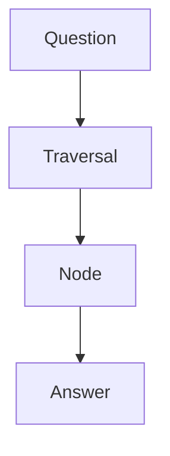
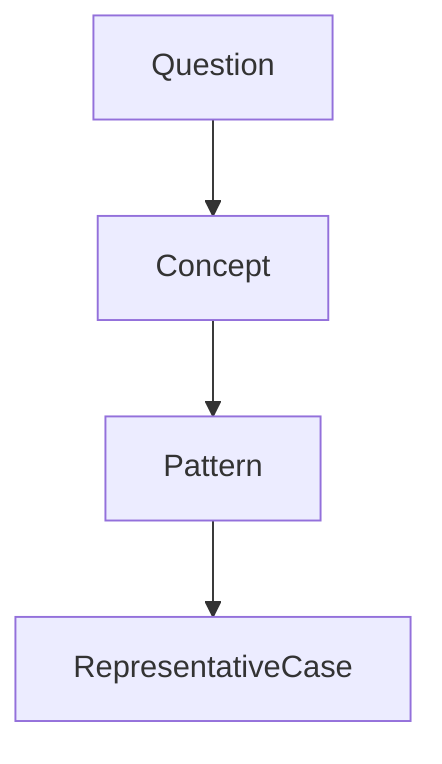
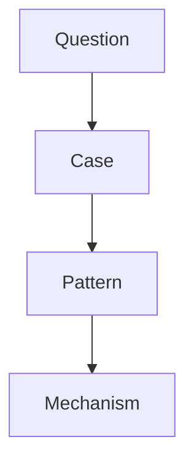
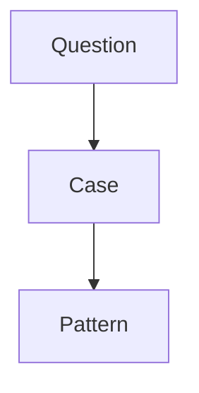
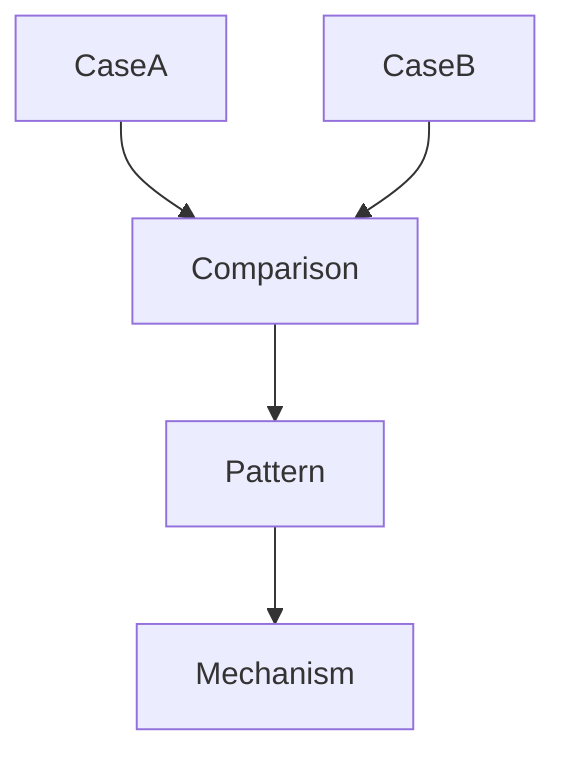
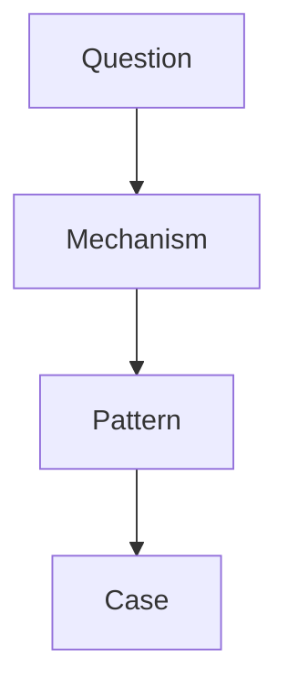
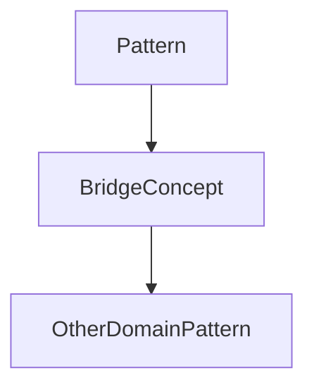
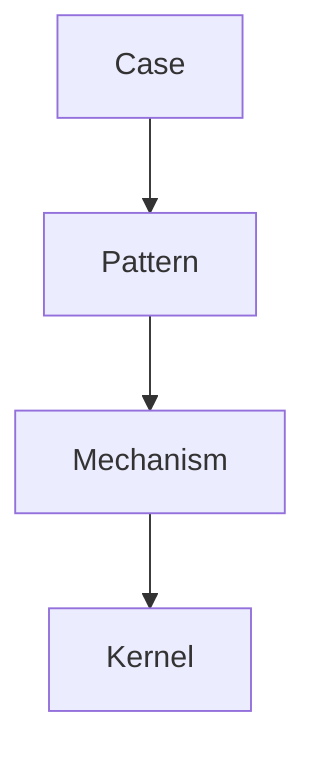

# Question → Traversal Mapping

Question → Traversal Mapping は、Knowledge Graph において  
**質問の種類に応じてどのノードを辿るべきかを定義する構造**である。

Knowledge Graph はノードとエッジで構成されているが、  
質問が来たときに **どの順で探索するか** を決めないと

- 無関係なノードを辿る
- 抽象に飛びすぎる
- case ばかり参照する
- 推論が一貫しない

といった問題が起きる。

Question → Traversal Mapping は  
**質問 → 推論ルート** を対応づける。

---

# 基本構造



---

# 質問タイプ

Knowledge Graph では  
質問は大きく5種類に分類できる。

|質問タイプ|目的|
|---|---|
|definition|概念理解|
|causal|原因理解|
|pattern|構造理解|
|comparison|差異理解|
|prediction|未来予測|

---

# Traversal の基本階層

Knowledge Graph は通常次の層を持つ。

```
case
pattern
mechanism
concept
kernel
```

Traversal は  
この階層を上下する。

---

# Definition Question

例

```
○○とは何か
```

Traversal

```
concept
 ↓
pattern
 ↓
representative case
```

図



---

# Causal Question

例

```
なぜ○○が起きたのか
```

Traversal

```
case
 ↓
pattern
 ↓
mechanism
```

図



---

# Pattern Question

例

```
○○はどんな構造か
```

Traversal

```
case
 ↓
pattern
```

図



---

# Comparison Question

例

```
AとBの違い
```

Traversal

```
case A
case B
 ↓
pattern
 ↓
mechanism
```

図



---

# Prediction Question

例

```
今後どうなるか
```

Traversal

```
mechanism
 ↓
pattern
 ↓
case
```

図



---

# Cross Domain Question

例

```
○○は他の分野では何に似ているか
```

Traversal

```
pattern
 ↓
bridge concept
 ↓
other domain pattern
```

図



---

# Traversal のルール

Traversal は次を守る。

---

## Rule1  
まず **case から始める**

---

## Rule2  
次に **pattern**

---

## Rule3  
その後 **mechanism**

---

## Rule4  
最後に **kernel**

---

# Traversal 図



---

# Question → Traversal の表

|質問|Traversal|
|---|---|
|定義|concept → pattern|
|原因|case → pattern → mechanism|
|構造|case → pattern|
|比較|case → pattern → mechanism|
|予測|mechanism → pattern → case|

---

# Knowledge Graph との関係

Knowledge Graph は  
ノードの集合である。

Question → Traversal Mapping は

```
どの順でノードを辿るか
```

を決める。

---

# LLM にとっての意味

Question → Traversal Mapping があると

LLM は

- 推論の順序を守る
- 関連ノードを探索する
- 思考の再現性が高まる

---

# 関連ノート

- [[Reasoning Strategy]]
- [[Graph Traversal Rules]]
- [[Knowledge Graph Structure]]
- [[Pattern]]
- [[Mechanism]]
- [[Bridge Concept]]