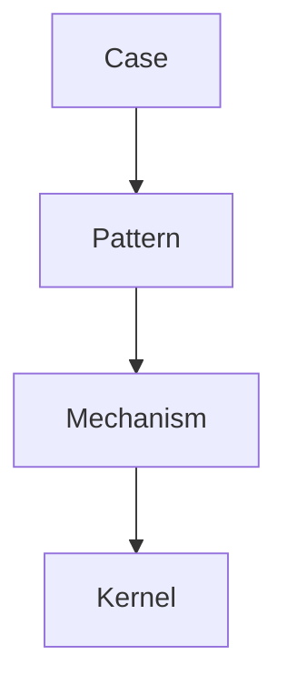
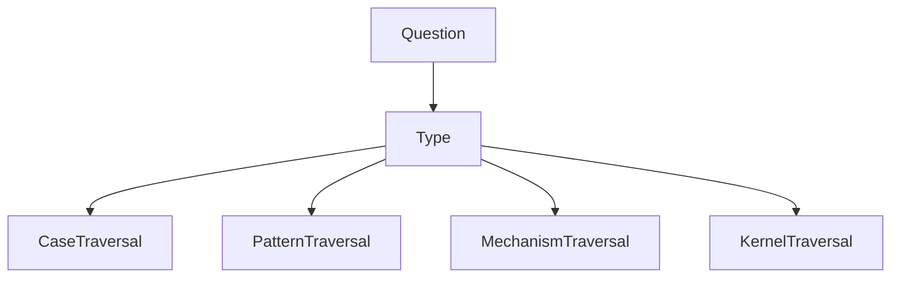
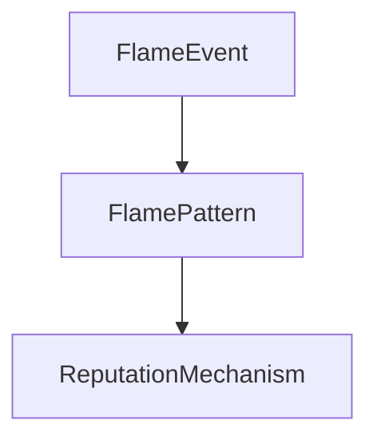
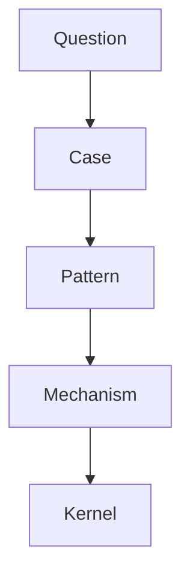

# Question → Traversal Mapping

Question → Traversal Mapping は  
**質問の種類に応じて Knowledge Graph の探索経路（Traversal）を決定する方法**である。

Knowledge Graph は

```
Case
Pattern
Mechanism
Kernel
```

という階層を持つため、  
質問の種類によって探索開始点や方向が変わる。

---

# Question → Traversal Mapping の目的

この方法の目的

- 推論の効率化  
- 誤った探索の防止  
- Reasoning Strategy の選択  

---

# Knowledge Graph の探索階層



質問はこのどこからでも始まる。

---

# Question の主な種類

Knowledge Graph では質問は主に5種類に分類できる。

|質問タイプ|意味|
|---|---|
|What|現象の説明|
|Why|原因探索|
|How|メカニズム|
|Example|具体例|
|Analogy|類推|

---

# Question → Traversal Mapping

## What Question

例

```
これは何か？
```

Traversal

```
Case → Pattern
```

---

## Why Question

例

```
なぜ起きるのか？
```

Traversal

```
Pattern → Mechanism
```

---

## How Question

例

```
どうやって起きるのか？
```

Traversal

```
Mechanism
```

---

## Example Question

例

```
具体例は？
```

Traversal

```
Pattern → Case
```

---

## Analogy Question

例

```
似た現象は？
```

Traversal

```
Pattern ↔ Pattern
Mechanism ↔ Mechanism
```

---

# Mapping 図



---

# Traversal の選択

質問の種類ごとに  
探索開始点が変わる。

|質問|開始ノード|
|---|---|
|何か|Case|
|なぜ|Pattern|
|どうやって|Mechanism|
|原理|Kernel|

---

# Traversal 例

質問

```
なぜ炎上が起きるのか
```

Traversal



---

# 複合質問

多くの質問は  
複数の Traversal を含む。

例

```
なぜ炎上が起きるのか？
具体例は？
```

Traversal

```
Pattern → Mechanism
Pattern → Case
```

---

# Reasoning Path

Question → Traversal Mapping により  
Reasoning Path が形成される。



---

# Mapping の利点

この仕組みがあると

- 推論が高速になる  
- 不必要な探索を減らせる  
- LLM reasoning を安定させる  

---

# LLM と Question Mapping

LLM は質問から

```
question type
```

を推定し  
Traversal を決定する。

---

# Mapping の注意

---

### 質問の誤分類

誤った Traversal を選ぶ。

---

### 抽象度不一致

```
case → kernel
```

のジャンプが起きる。

---

### pattern を飛ばす

推論が壊れる。

---

# 関連ノート

- [[Graph Traversal Rules]]
- [[Reasoning Strategy]]
- [[Knowledge Graph Structure]]
- [[Pattern]]
- [[Mechanism]]