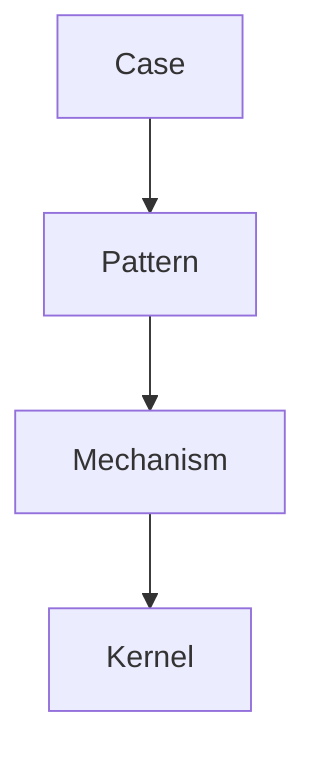
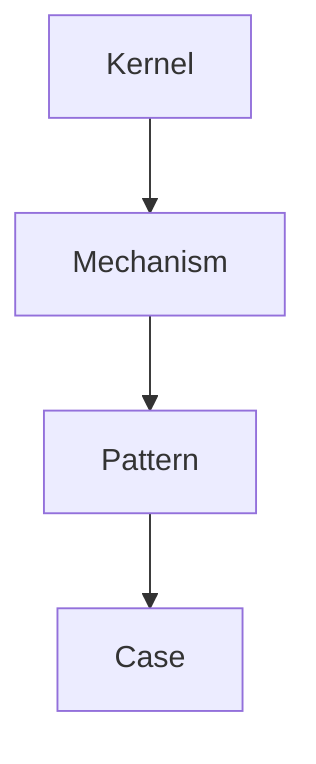
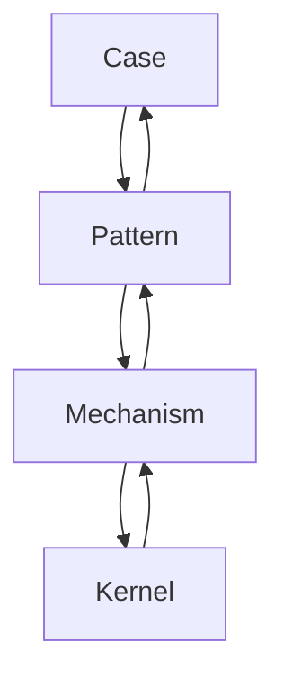
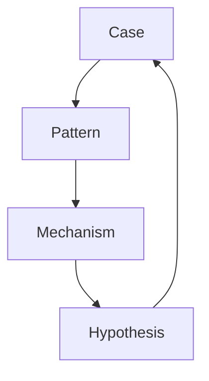
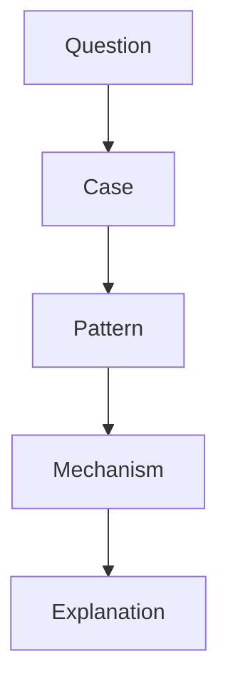

# Reasoning Strategy

Reasoning Strategy は、Knowledge Graph を用いて  
**どのような順序・方法で推論を行うかを定義する戦略ノート**である。

Knowledge Graph には

- case
- pattern
- mechanism
- concept
- kernel

など多くのノードが存在する。

しかし **推論の進み方を決めないと** 次の問題が起きる。

- 思考が迷子になる  
- 抽象に飛びすぎる  
- case に閉じる  
- 推論の再現性がなくなる  

Reasoning Strategy は  
Knowledge Graph の **思考ルート設計** である。

---

# 推論の基本構造

Knowledge Graph の推論は通常次の階層を上がる。



また逆方向の推論もある。



---

# 推論の主要戦略

Reasoning Strategy は大きく5種類ある。

---

## 1 Inductive Reasoning

具体 → 抽象

```
case
 ↓
pattern
 ↓
mechanism
```

目的

- 新しい pattern を発見  
- mechanism 仮説を作る

---

## 2 Deductive Reasoning

抽象 → 具体

```
mechanism
 ↓
pattern
 ↓
case
```

目的

- 予測  
- 応用  

---

## 3 Analogical Reasoning

類比推論

```
domain A
 ↓
bridge concept
 ↓
domain B
```

目的

- cross domain insight

---

## 4 Comparative Reasoning

比較推論

```
case A
case B
case C
 ↓
共通構造
```

目的

- pattern 発見

---

## 5 Mechanistic Reasoning

因果推論

```
結果
 ↓
原因
```

目的

- mechanism 推定

---

# 推論戦略の図



---

# Reasoning Strategy の選択

推論は問題の種類によって変わる。

|問題|戦略|
|---|---|
|未知構造|induction|
|予測|deduction|
|異分野理解|analogy|
|比較|comparison|
|原因分析|mechanistic|

---

# Reasoning Strategy の実行

推論は次の手順で行う。

---

## Step1  
問題を定義する。

---

## Step2  
関連 case を集める。

---

## Step3  
pattern を抽出する。

---

## Step4  
mechanism を推測する。

---

## Step5  
bridge concept を探す。

---

# 推論のループ

Knowledge Graph 推論は  
通常ループする。



---

# 推論の注意

---

### 1 過度な抽象化

抽象だけでは現実を説明できない。

---

### 2 単一 case

case が少ないと誤推論になる。

---

### 3 類比の誤用

似ているだけで同じとは限らない。

---

# Reasoning Strategy と Knowledge Graph

Knowledge Graph は  
**推論を支える構造**である。

```
node
edge
traversal
```

Reasoning Strategy は

```
どの順で traversal するか
```

を決める。

---

# Reasoning Strategy の図



---

# LLM にとっての意味

Reasoning Strategy があると  
LLM は

- 一貫した推論  
- 再現可能な思考  
- 知識の横断利用  

ができる。

---

# 関連ノート

- [[02_zettelkasten/Zettelkasten Engine/04_meta/knowledge_graph/Question → Traversal Mapping]]
- [[Graph Traversal Rules]]
- [[Knowledge Graph Structure]]
- [[Pattern]]
- [[Mechanism]]
- [[Bridge Concept]]