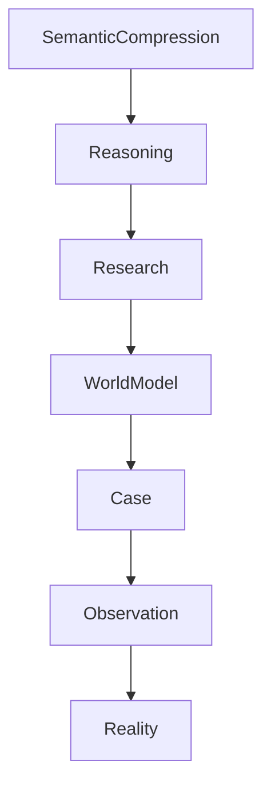
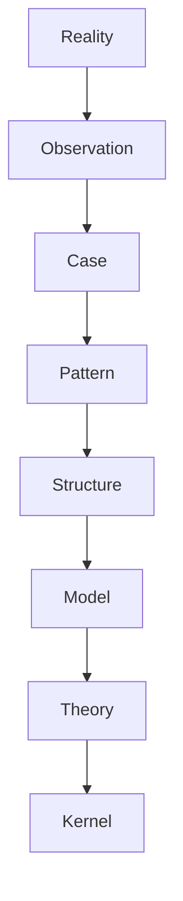
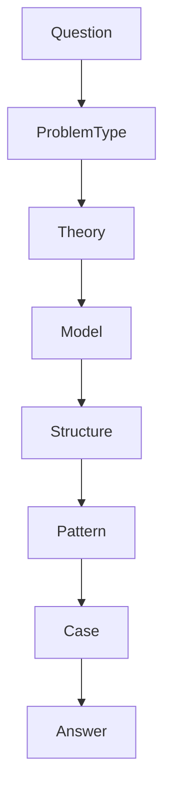
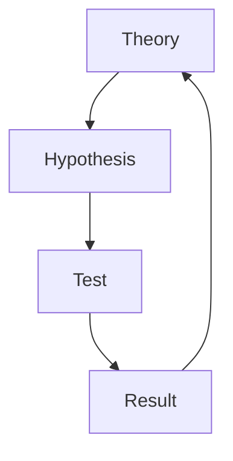

# Knowledge Layers

Knowledge Layers は Vault における知識の機能階層を定義する。

Vault は単なる知識管理ではなく、

- Knowledge OS
- Reasoning OS
- Research OS

の三層構造で動作する。

---

# Layer Structure



---

# Layer Overview

| Layer | 役割 |
|------|------|
|Semantic Compression | LLM理解の高速化 |
|Reasoning | 思考制御 |
|Research | 理論検証 |
|World Model | 世界の説明 |
|Case | 事例 |
|Observation | 観測 |
|Reality | 現実 |

---

# 1 Semantic Compression Layer

Vaultの知識をAIが理解しやすい形に圧縮する。

主なノート

- Kernel Map
- Theory Map
- Model Map
- Structure Map
- Pattern Map
- Reasoning Map

目的

- コンテキスト節約
- 推論高速化

---

# 2 Reasoning Layer

AIと人間の思考手順を制御する。

主なノート

- Problem Classifier
- Model Selector
- Reasoning Pipeline
- Evaluation Rules
- Output Structure

---

# 3 Research Layer

理論を検証し更新する層。

主なノート

- Research Program
- Hypothesis
- Test
- Dataset
- Result

---

# 4 World Model Layer

世界の仕組みを説明する。

主なノート

- Kernel
- Theory
- Model
- Structure
- Mechanism
- Pattern

---

# 5 Case Layer

理論の適用対象となる具体事例。

例

- 歴史事件
- 組織事例
- 社会現象

---

# 6 Observation Layer

観測された事実。

例

- 発言
- 行動
- 数値
- 史料

---

# 7 Reality Layer

Vault外部の現実世界。

---

# Knowledge Flow



---

# Reasoning Flow



---

# Research Flow



---

# Layer Interaction

Knowledge Layers は次の3つのOSを形成する。

```
Knowledge OS
Reasoning OS
Research OS
```

---

# 関連ノート

[[Ontology]]
[[99_oldzettelkasten/Concept Hub]]
[[Semantic Compression]]
[[Inference Hub]]