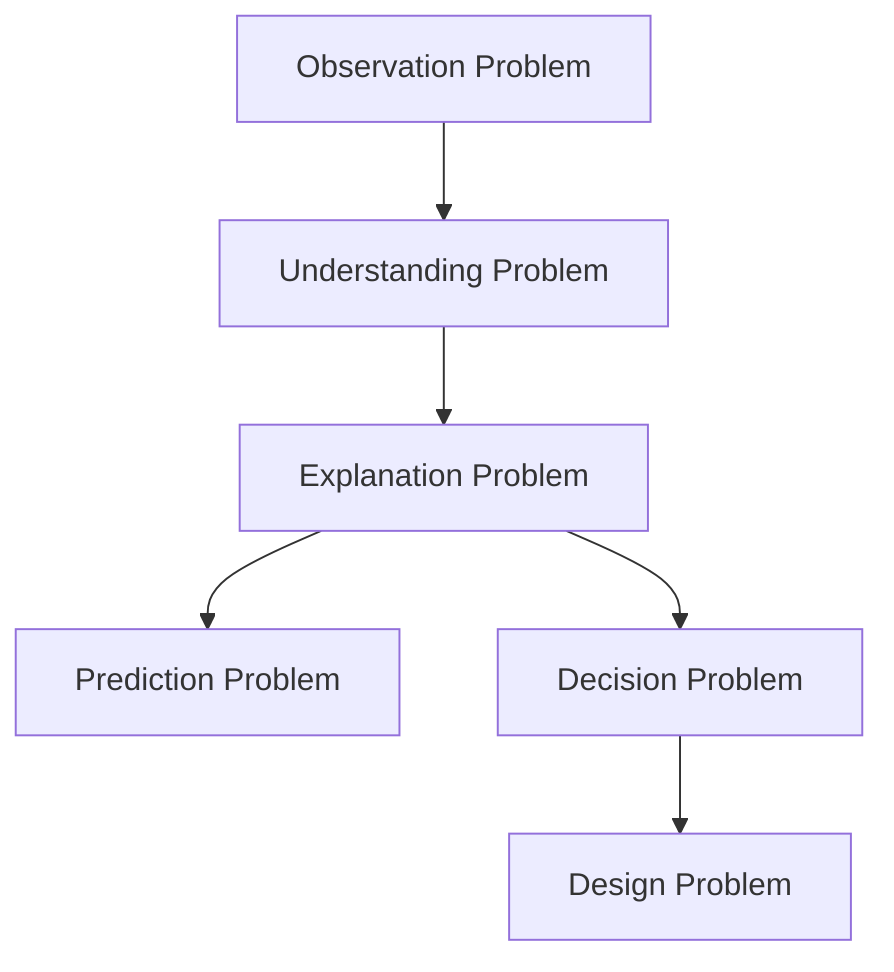

# Problem Type

問題は構造によって種類が異なる。  
Problem Type は**問題の性質を分類する枠組み**である。

問題の種類を誤ると  解決方法も誤る。

---

# 問題の基本分類

```
Observation Problem
Understanding Problem
Explanation Problem
Prediction Problem
Decision Problem
Design Problem
```

---

# 1 Observation Problem

現象を把握する問題。

例

- 何が起きているのか
- 規模はどの程度か
- どこで発生しているか

例

- 交通渋滞の発生地点
- 人口減少の地域分布

使用ツール

- [[observation]]
- [[Measurement]]（[[Measurement]]）
- [[Data Collection]]

---

# 2 Understanding Problem

構造を理解する問題。

例

- この街の都市構造はどうなっているか
- この産業の構造はどうなっているか

使用ツール

- [[Structure Analysis]]
- [[System Mapping]]

---

# 3 Explanation Problem

原因を説明する問題。

例

- なぜ交通渋滞が起きるのか
- なぜ国家が崩壊するのか

使用ツール

- [[Causual Reasoning Hub]]
- [[Mechanism Identification]]

---

# 4 Prediction Problem

未来を予測する問題。

例

- 人口はどう変化するか
- 技術はどう発展するか

使用ツール

- [[Trend Analysis]]
- [[02_zettelkasten/Zettelkasten Engine/03_process/methods/analysis/シナリオ分析|シナリオ分析]]

---

# 5 Decision Problem

複数の選択肢から選ぶ問題。

例

- どの戦略を取るべきか
- どの政策を採用するか

使用ツール

- [[Decision Analysis]]
- [[Expected Value Model]]

---

# 6 Design Problem

新しい解決策を設計する問題。

例

- 新しい制度を設計する
- 新しいビジネスモデルを作る

使用ツール

- [[Solution Design Hub]]
- [[System Design]]

---

# Problem Type Map



---

# Thinking Engineとの関係

```
Problem
   ↓
Problem Type
   ↓
Diagnostic Questions
   ↓
Reasoning
   ↓
Decision
   ↓
Solution
```

---

# 関連ノート

- [[Diagnostic Questions]]
- [[Research Loop]]
- [[Thinking Engine]]
- [[Hypothesis Hub]]
