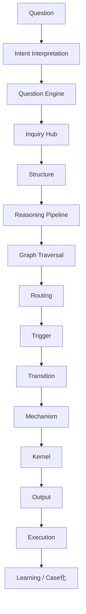

# Summary
問いを受け取り、思考の出発点（Entry Node）と全体の処理フローを決定するハブ

---

# Description
Entry Hubは思考OSにおける「実行開始地点」であり、  
Question Engineによって分類された問いを、

- どの知識レイヤーから開始するか（Entry Node）
- どの思考モードで処理するか（Inquiry）
- どの推論経路を通るか（Graph Traversal）

に分解し、全体の処理を接続する

---

# Core Flow

# Step-by-Step Process

## Precondition

- 入力は必ずValidated Caseであること
- 未検証情報は禁止

## NG

- 未検証情報から開始
- 推測をCaseとして扱う

## ① 意図解釈（Intent Interpretation）
問いの目的・制約・期待を明確化する
使用ノート：
- [[Intent Interpretation]]
- [[Goal Framing]]
- [[Mode Selection]]
## ② Question Engine
問いを分類し、Entry Nodeを決定する
使用ノート：
- [[Question Engine]]
- [[02_zettelkasten/Zettelkasten Engine/04_meta/knowledge_graph/Question → Traversal Mapping]]
- [[Question Engine Map]]
## ③ Inquiry（思考モード決定）
問いの型に応じて思考モードを選択
分類：
- [[inquiry Hub]]
- Reading
- Argument
- Problem
使用ノート：
- [[inquiry Hub]]
## ④ Structure（思考の型）
思考の枠組みを決定
使用ノート：
- argument系構造
- problem系構造
- reading系構造
## ⑤ Reasoning（推論開始）
思考エンジンを起動
使用ノート：
- [[Reasoning Pipeline]]
- [[Inference Hub]]
## ⑥ Graph Traversal（思考本体）
知識グラフ上を移動する
典型経路：
- Case → Pattern
- Pattern → Mechanism
- Mechanism → Kernel
使用ノート：
- [[Graph Traversal Rule]]
## ⑦ Routing（因果選択）
適用する因果構造を選択
使用ノート：
- [[Question Routing Engine]]
- [[Routing Matrics]]
## ⑧ Trigger / Transition（動力学）
変化の引き金と遷移を特定
使用ノート：
- [[Trigger Taxonomy]]
- [[Transition Types Taxonomy]]
## ⑨ Mechanism → Kernel
因果から原理へ到達
## ⑩ Output生成
出力形式に変換
使用ノート：
- [[出力構造]]
- [[評価基準]]
- [[Weak Explanation Check]]
## ⑪ Execution
実行フェーズへ接続
使用ノート：
- execution
- methods
- projects
## ⑫ Learning（フィードバック）
結果を知識に昇格
使用ノート：
- [[Learning Hub]]
- [[02_zettelkasten/Zettelkasten Engine/00_system/Case to Pattern Promotion]]
- [[Mismatch Detection Engine]]
# Entry Node Selection

|Entry|使用条件|
|---|---|
|Case|具体事例から考える|
|Pattern|一般化から考える|
|Mechanism|因果から考える|
|Kernel|原理から設計する|
|Model|抽象モデルを使う|
|Theory|理論から展開する|

# Key Insight|
- 思考は「Graph Traversal」である
- 問いは「開始地点と経路」を決める
- Entry Hubはその分岐を統合する
# Implications
- 問いの処理は固定順序ではなく、グラフ探索である
- Entry選択を誤ると全体の推論が崩れる
- Entry Hubは思考の「起動点制御装置」である
# Links
[[Question Engine]]
[[inquiry Hub]]
[[Routing Matrics]]
[[Inverse Routing Matrics]]
[[Thinking Engine Hub]]