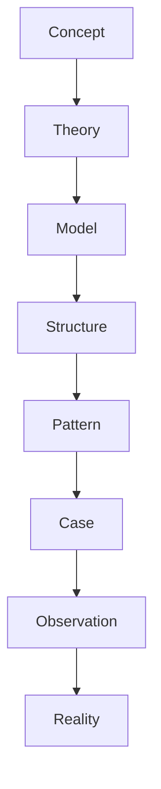
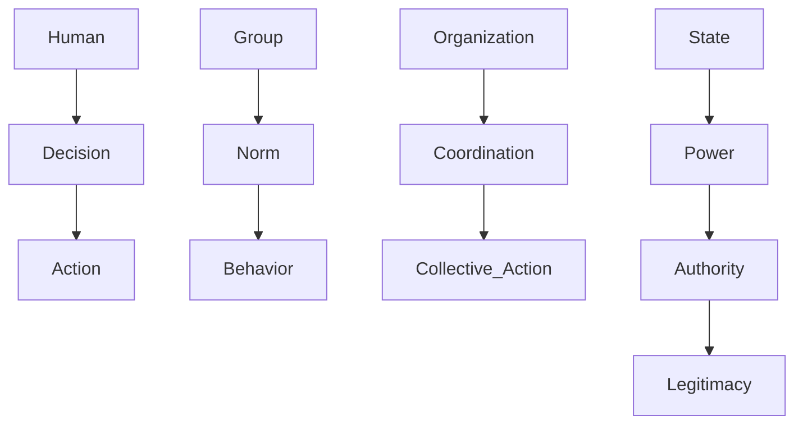
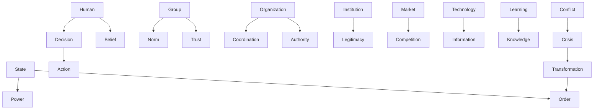

---
layer: concept
type: hub
status: stable
---

# Concept Hub

Concept Layer はVault全体の語彙体系である。  
すべてのノート（theory / model / structure / pattern / case / domain）は、  
Concept を共有することで接続される。

Concept は **世界を記述する最小単位の意味ノード**である。

---

# Concept Layer の役割

Concept Layer は次の4つの機能を持つ。

1. 語彙統制（Vocabulary Control）
2. 概念関係（Concept Graph）
3. 知識統合（Knowledge Integration）
4. LLM推論安定化（Semantic Stability）

---

# Vault における位置



Concept はすべての知識層の基盤となる。

---

# Concept の型

Concept は5つの型に分類される。

## Entity

存在する主体。

例

- Human
- Organization
- Institution
- State
- Market
- Technology

---

## Cognitive

人間の認知。

例

- Information
- Attention
- Belief
- Knowledge
- Narrative

---

## Social

社会関係。

例

- Norm
- Power
- Authority
- Legitimacy
- Trust

---

## Process

行動や変化。

例

- Decision
- Learning
- Coordination
- Competition
- Conflict
- Adaptation

---

## State

状態。

例

- Order
- Stability
- Crisis
- Collapse
- Transformation

---

# Concept Graph

Concept は relation によって接続される。





---

# Concept と他の層の関係

## Concept → Theory

理論は概念の関係を説明する。

例

```
Power + Legitimacy → Authority
```

---

## Concept → Model

モデルは概念を形式化したもの。

例

```
Decision → Expected Value Model
```

---

## Concept → Structure

構造は概念の配置。

例

```
Hierarchy
Network
Market
```

---

## Concept → Pattern

パターンは概念関係の繰り返し。

例

```
Power concentration
Bureaucratic delay
Social conformity
```

---

## Concept → Case

事例は概念の具体例。

例

```
French Revolution
Microsoft
Tokugawa Shogunate
```

---

# Concept の設計原則

Concept を作る際は次を守る。

1. 抽象度を一定に保つ  
2. 複数分野で使える語彙にする  
3. 因果関係に使える概念にする  
4. 定義を簡潔にする  

---

# 関連ノート

[[02_zettelkasten/04_meta/ontology/Concept Types]]

[[02_zettelkasten/04_meta/ontology/Relation Types]]

[[Causal Relations]]

[[02_zettelkasten/04_meta/knowledge_graph/Ontology]]

---

# Concept Layer の目的

Concept Layer は

- Vault を Knowledge Graph 化する
- AI の推論精度を上げる
- 分野を越えて知識を接続する

ための基盤である。