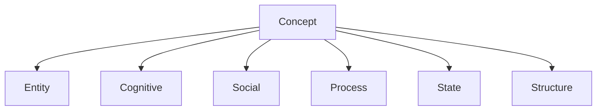
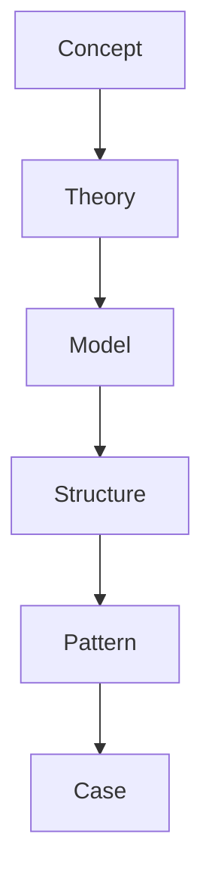

# Concept Types

Concept Types は Vault における概念の型（カテゴリー）を定義する。

Concept は意味の最小単位であり、型を明確にすることで  
Concept Graph・Theory・Model・Structure を安定させる。

---

# Concept Type Hierarchy

---

# 1 Entity

Entity は存在する主体または対象。

## 特徴

- 行動主体または対象
- 観察可能
- 多くの場合 agent を含む

## 例

- Human
- Group
- Organization
- Institution
- State
- Market
- Technology

---

# 2 Cognitive

Cognitive は人間の認知・意味処理。

## 特徴

- 心理的概念
- 意味・認識・解釈

## 例

- Information
- Attention
- Belief
- Knowledge
- Narrative

---

# 3 Social

Social は社会関係や社会構造を形成する概念。

## 特徴

- 集団行動に関係
- 権力・規範・信頼など

## 例

- Norm
- Power
- Authority
- Legitimacy
- Trust

---

# 4 Process

Process は行動・変化・進行する現象。

## 特徴

- 時間的変化
- 行動または進行

## 例

- Decision
- Learning
- Coordination
- Competition
- Conflict
- Adaptation

---

# 5 State

State はシステムの状態。

## 特徴

- 一時的または長期状態
- システム全体の状態

## 例

- Order
- Stability
- Crisis
- Collapse
- Transformation

---

# 6 Structure

Structure は関係配置やシステム構造。

## 特徴

- 関係の配置
- システムの形

## 例

- Hierarchy
- Network
- Market
- Bureaucracy

---

# Concept と他層の関係

Concept はすべての知識層の基盤となる。

---

# Concept の設計原則

Concept を作る際は以下を守る。

1. 抽象度を揃える
2. 複数分野で使用できる語彙にする
3. 因果関係に使える概念にする
4. 定義を簡潔にする

---

# 関連ノート

[[Concept Hub]]

[[02_zettelkasten/Zettelkasten Engine/04_meta/ontology/Relation Types]]

[[Causal Relations]]

[[02_zettelkasten/04_meta/knowledge_graph/Ontology]]