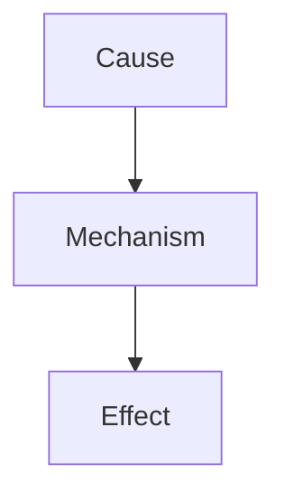
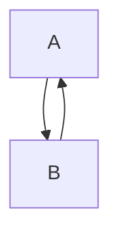
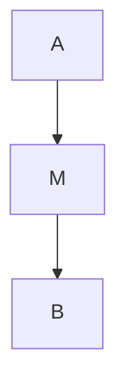
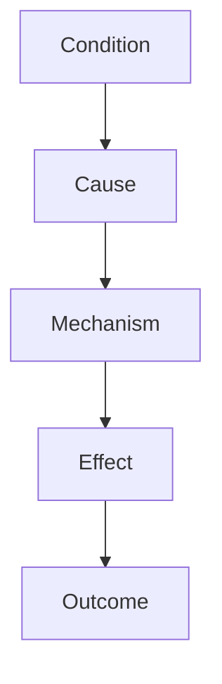

# Causal Relations

Causal Relations は概念・事象・構造の間に存在する因果関係を定義する。

因果関係は推論・理論・メカニズムの基盤となる。

---

# 因果関係の基本構造



---

# Causal Relation Types

## causes

ある概念・事象が直接的に別の結果を生み出す。

例  
```
A causes B
```

例

```
Inflation causes social unrest
```

---

## caused_by

結果側から原因を表す。

```
B caused_by A
```

---

## enables

ある条件が存在することで結果が可能になる。

```
A enables B
```

例

```
Technology enables industrialization
```

---

## constrains

ある要因が行動や結果を制限する。

```
A constrains B
```

例

```
Resource scarcity constrains growth
```

---

## triggers

特定の出来事が結果を引き起こす引き金になる。

```
A triggers B
```

例

```
Assassination triggers war
```

---

## amplifies

既存の効果を強める。

```
A amplifies B
```

例

```
Media amplifies social conflict
```

---

## dampens

効果を弱める。

```
A dampens B
```

例

```
Institutions dampen political instability
```

---

## feedback

結果が原因に戻る循環関係。



例

```
Economic growth ↔ investment
```

---

## indirect_cause

中間メカニズムを通して影響する。



例

```
Education → innovation → economic growth
```

---

# 因果関係の階層



---

# 因果分析で確認すること

因果関係を判断する際には次を確認する。

1. 時系列  
2. メカニズム  
3. 代替説明  
4. 再現性  

---

# 関連ノート

[[02_zettelkasten/Zettelkasten Engine/04_meta/ontology/Relation Types]]  
[[99_oldzettelkasten/04_knowledge_graph/Mechanism]]  
[[Reasoning Pipeline]]  
[[Theory]]