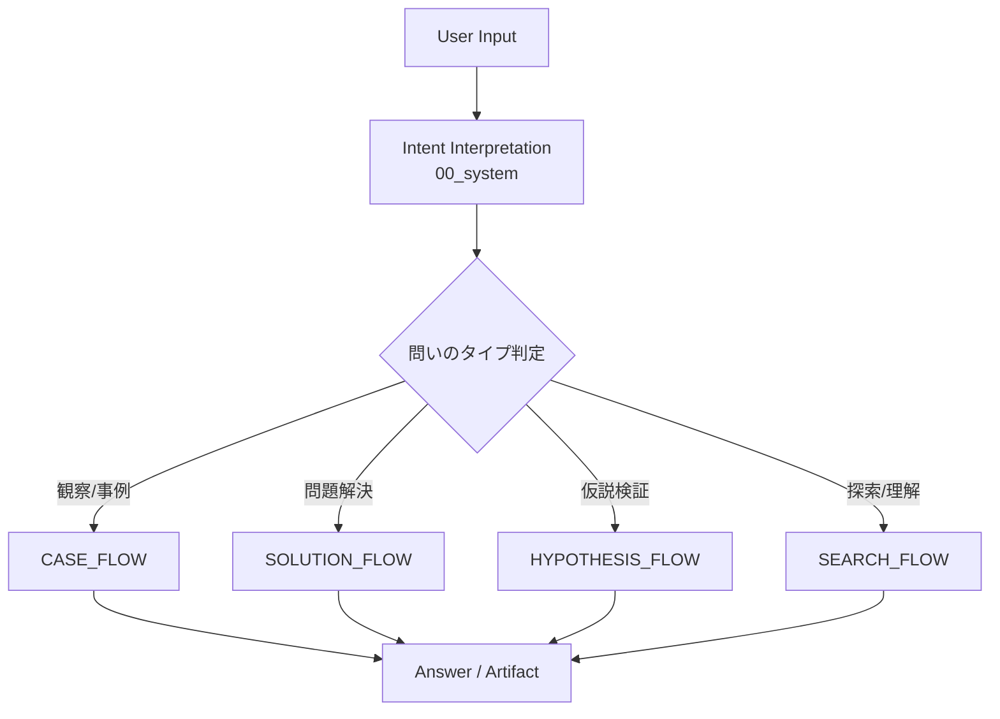
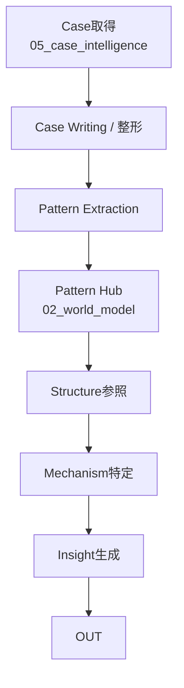
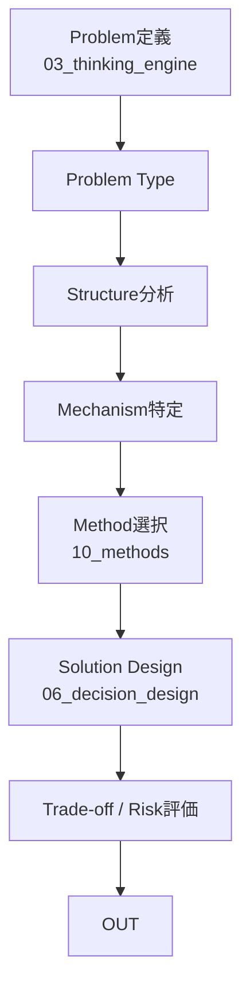
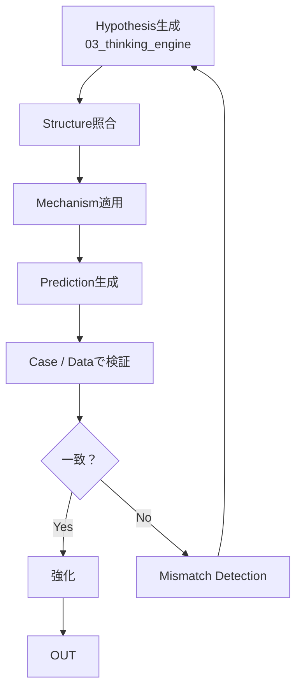
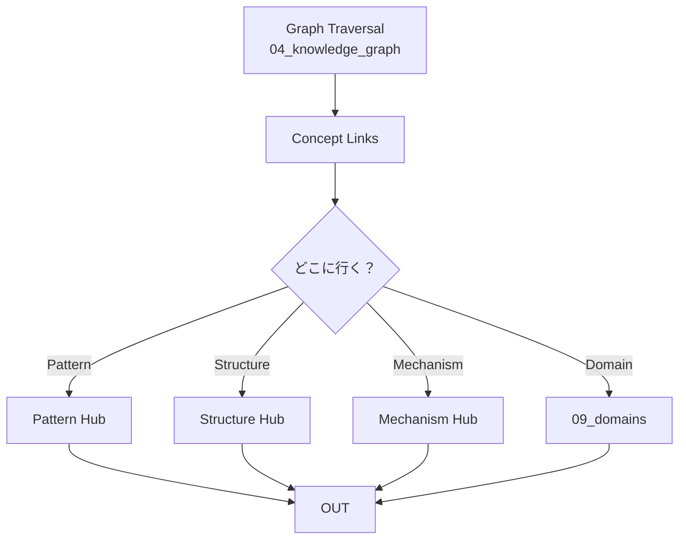
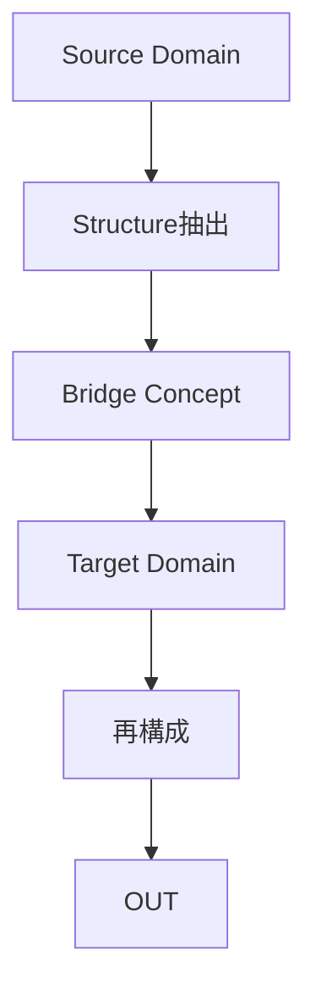
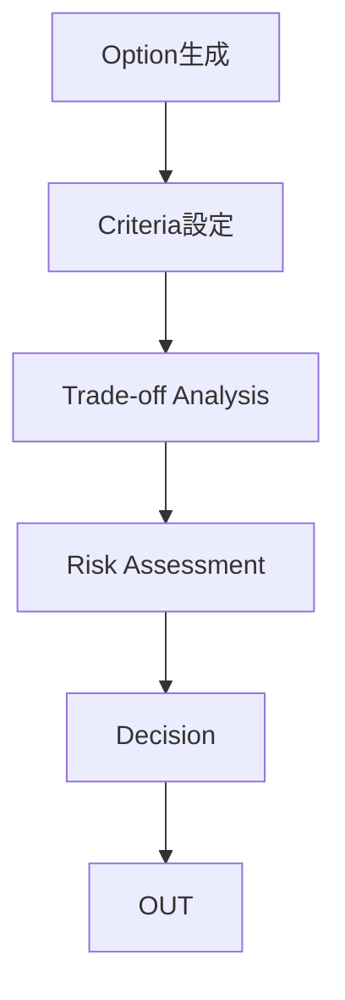
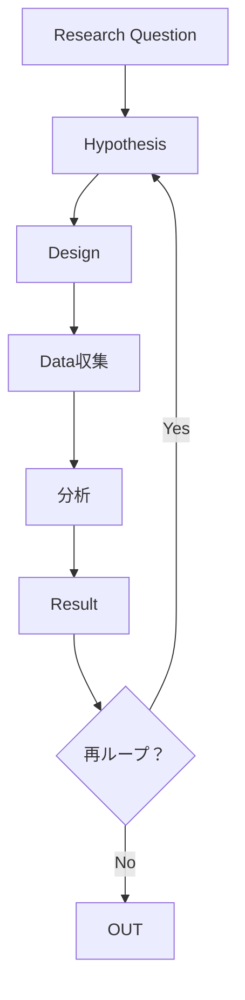
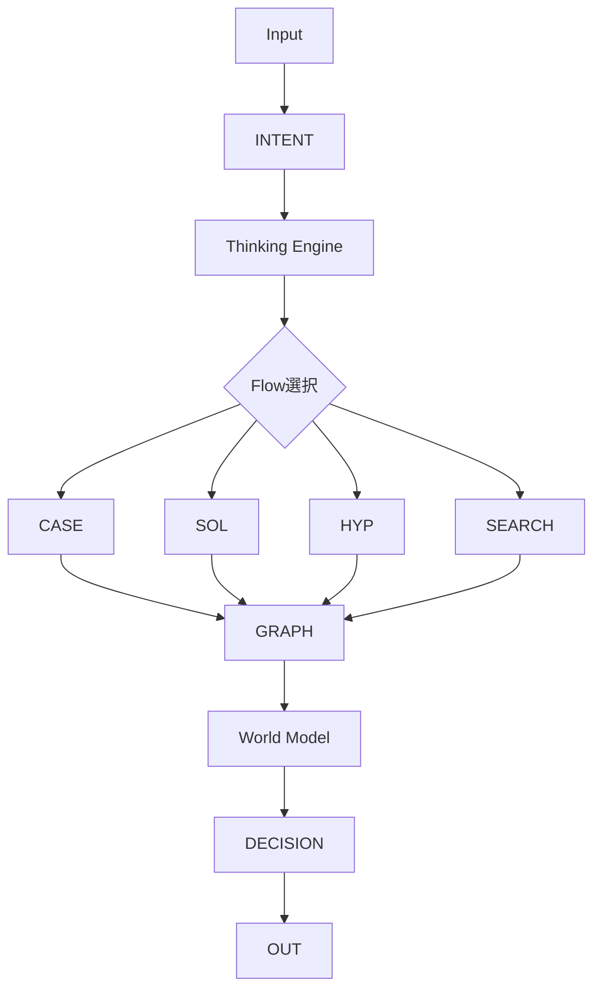

# 全体

---

# Case フロー

# 対応ノート
- [[02_zettelkasten/04_knowledge_graph/Case Writing Rule|Case Writing Rule]]
- [[Pattern Extraction Method 1|Pattern Extraction Method 1]]
- [[02_zettelkasten/Zettelkasten Engine/04_meta/knowledge_graph/Pattern Boundary Rule|Pattern Boundary Rule]]
- [[02_zettelkasten/Zettelkasten Engine/02_knowledge/world_model/pattern/Pattern Hub|Pattern Hub]]
- [[Structure Hub]]
- [[02_zettelkasten/Zettelkasten Engine/02_knowledge/world_model/meta/mechanism/Mechanism Hub|Mechanism Hub]]

---

# Solution フロー

## 対応ノート
- [[Problem Type]]
- [[Diagnostic Questions]]
- [[Structure Hub]]
- [[02_zettelkasten/Zettelkasten Engine/02_knowledge/world_model/meta/mechanism/Mechanism Hub|Mechanism Hub]]
- [[Method Hub]]
- [[02_zettelkasten/00_head/06_decision_design/Decision Hub|Decision Hub]]
- [[Trade-off Analysis]]

---

# Hypothesis フロー

## 対応ノート
- [[Hypothesis Hub]]
- [[Mismatch Detection Engine]]
- [[Expectation Model]]
- [[Measurement]]
- [[datasets]] / [[test]]

---

# Search フロー

## 対応ノート
- [[Graph Traversal|Graph Traversal]]
- [[Concept Links|Concept Links]]
- [[Cross Domain Mapping|Cross Domain Mapping]]
- [[Bridge Concept|Bridge Concept]]

---

# Cross Domain フロー

## 対応ノート
- [[Cross Domain Mapping|Cross Domain Mapping]]
- [[Bridge Concept|Bridge Concept]]
- [[Bridge Detection Method|Bridge Detection Method]]

---

# Desicion フロー

## 対応ノート
- [[02_zettelkasten/00_head/06_decision_design/Decision Hub|Decision Hub]]
- [[Trade-off Analysis]]
- [[Risk Assessment]]
- [[Option Comparison]]

---

# Research フロー

## 対応ノート
- [[Research Loop|Research Loop]]
- [[Research Question|Research Question]]
- [[datasets]] / [[test]] / [[results]]

---

## 対応ノート
- [[Research Loop|Research Loop]]
- [[Research Question|Research Question]]
- [[datasets]] / [[test]] / [[results]]

---

# 実行時の統合ビュー

---

# 実行時の実際の順番
## 1. 入口
- [[Intent Interpretation|Intent Interpretation]]
- [[Mode Selection|Mode Selection]]
## 2. 思考開始
- [[Thinking Engine]]
- [[Problem Type]] / [[Question Engine]]
## 3. 探索
- [[Graph Traversal|Graph Traversal]]
- [[Concept Links|Concept Links]]
## 4. 知識参照
- [[Pattern|Pattern]] / [[Structure Map]] / [[Mechanism|Mechanism]] / [[Domain Types|Domain Types]]
## 5. 推論
- [[Reasoning Strategy|Reasoning Strategy]]
- [[Hypothesis Hub]] or [[Pattern Extraction 1|Pattern Extraction 1]]
## 6. 出力生成
- [[02_zettelkasten/00_head/06_decision_design/Decision Hub|Decision Hub]] or [[Solution Design Hub]]
## 7. 必要なら
- [[Research Loop|Research Loop]]

#  このマップの本質
1. 問いを分類する → Intent
2. フローを選ぶ → Thinking Engine
3. グラフを辿る → Knowledge Graph
4. 知識を当てる → World Model
5. 答えを作る → Decision / Solution