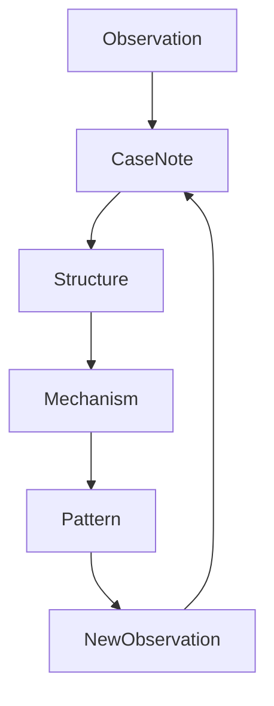

# Case Development Method
Caseノートの育て方

---

layer: method
type: knowledge_growth

---

# 概要

Caseノートは

「出来事・事例・観察」

を蓄積する層である。

Vaultの推論は

Concept  
Pattern  
Mechanism  

から構成されるが、

それらの多くは **Caseから抽出される。**

そのためCaseノートは

観察 → 構造化 → 抽象化 → パターン化

というプロセスで育てていく。

---

# Caseノートの役割

Caseは以下の役割を持つ。

1 観察の保存  
2 パターン抽出の素材  
3 機構（Mechanism）の検証  
4 比較分析の基準  
5 仮説検証のデータ  

つまりCaseは

Vaultの「データ層」

である。

---

# Caseの種類

Caseには4種類ある。

## Event Case

出来事

例

韓国併合  
フランス革命  
ベルリンの壁崩壊  

---

## Actor Case

人物・主体

例

ビスマルク  
ナポレオン三世  

---

## Place Case

場所

例

金沢  
東京駅  
浅草  

---

## System Case

制度・組織

例

総督府  
EU  
徳川幕府  

---

# Caseの基本構造

Caseノートは以下の構造で書く。

---

概要  
何が起きたか

---

状況  
どのような条件だったか

---

行動  
主体は何をしたか

---

結果  
何が起きたか

---

構造  
どのConcept / Patternに関係するか

---

Mechanism  
背後にある仕組み

---

比較可能Case  
似ている事例

---

# Caseノートの書き方テンプレート
# Case: ○○

## 概要

出来事の説明

## 状況

政治  
社会  
経済  
地理

## 主体

誰が行動したか

## 行動

具体的行動

## 結果

何が起きたか

## 関連Concept

[[概念]]

## 関連Pattern

[[パターン]]

## 関連Mechanism

[[メカニズム]]

## 類似Case

[[Case]]

  
---  
  
# Caseの成長段階  
  
Caseは4段階で育つ。  
  
---  
  
## Stage1 観察  
  
単なる記録  
  
例  
  
「韓国併合が起きた」  
  
---  
  
## Stage2 構造化  
  
出来事の構造を書く  
  
例  
  
外交圧力    
軍事力    
制度統合    
  
---  
  
## Stage3 Mechanism接続  
  
背後の仕組みを書く  
  
例  
  
Power Consolidation Mechanism  
  
---  
  
## Stage4 Pattern化  
  
複数Caseからパターン抽出  
  
例  
  
帝国拡張パターン  
  
---  
  
# Case比較法  
  
Caseは比較すると価値が上がる。  
  
比較軸  
  
主体    
権力構造    
制度    
情報    
結果    
  
---  
  
例  
  
韓国併合    
英領インド    
仏領アルジェリア    
  
---  
  
# CaseからPatternを作る方法  
  
3つ以上のCaseが集まると  
  
Patternを抽出する。  
  
方法  
  
共通構造を探す  
  
例  
  
帝国拡張  
  
国家    
↓    
軍事圧力    
↓    
政治統合    
↓    
行政支配    
  
---  
  
# CaseからMechanismを見つける方法  
  
以下を探す  
  
繰り返される因果  
  
例  
  
権力集中    
情報統制    
資源動員    
  
---  
  
# Caseノートを育てるループ  
  

---

# Caseノートを書くタイミング

Caseを書くのは以下の時。

観察した時  
読書した時  
歴史を調べた時  
都市を歩いた時  
ニュースを見た時

---

# Caseの品質

良いCaseノートは

具体的  
構造的  
比較可能

である。

---

# 悪いCaseノート

単なる説明

例

「韓国併合は日本が韓国を併合した出来事」

これは価値が低い。

---

# 良いCaseノート

構造がある

例

外交圧力  
軍事圧力  
制度統合

---

# Caseノートの最終目的

Caseは最終的に

Pattern  
Mechanism

を生み出す。

つまりCaseは

Vaultの

「知識の種」

である。