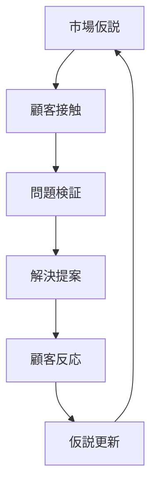

# PMF（Product Market Fit）

PMF（Product Market Fit）とは

**製品・サービスが市場の問題に適合している状態**

を指す。

スタートアップや新規事業では  
PMFの達成が最重要のマイルストーンである。

---

# PMFの基本構造

PMFは次の構造で成立する。
1. Market 
2. Customer 
3. Problem
4. Solution 
5. Value

---

# PMFの式

PMFは次の関係で成立する。
顧客問題 × 解決策 × 価値

つまり
Problem Fit + Solution Fit
が必要である。

---

# PMFの3要素

## 1 Market（市場）

どの市場の問題か。

評価軸

- 市場規模
- 成長性
- 競争状況

---

## 2 Problem（問題）

顧客が強く感じている問題。

良い問題の条件

- 頻繁に起きる
- 深刻である
- 解決コストが高い

---

## 3 Solution（解決）

問題を解決する方法。

重要
顧客が求めるのは、解決策の機能ではなく価値である。

---

# PMFの判定

PMFの状態は次のように分類できる。

## PMF未達

- 顧客が強く求めていない
- 売上が伸びない
- 営業が苦しい

---

## PMF接近

- 一部顧客で成功
- 紹介が発生
- 受注率が改善

---

## PMF達成

- 顧客から強い需要
- 営業効率が高い
- 市場が拡大

---

# PMFの兆候

PMFが近いと次の現象が起きる。

- 顧客から紹介が増える
- 顧客が継続利用する
- 価格より価値が評価される
- 営業が楽になる

---

# PMF探索プロセス

PMFは次のプロセスで探索する。

---

# PMFとGTM

GTMの構造
1. Market 
2. ICP 
3. Value 
4. Channel 
5. Sales 
6. Revenue
PMFは Market × Value の適合を確認するプロセスである。

---

# PMFと営業OS

営業OSとの関係
1. PMF 
2. GTM
3. Sales Strategy 
4. Sales Process
PMFなしで営業を拡大すると  
営業コストが増大し失敗する可能性が高い。

---

# まとめ

PMFとは、顧客問題と解決策が適合している状態である。
事業成功の最初の条件は、市場と製品の組み合わせである。