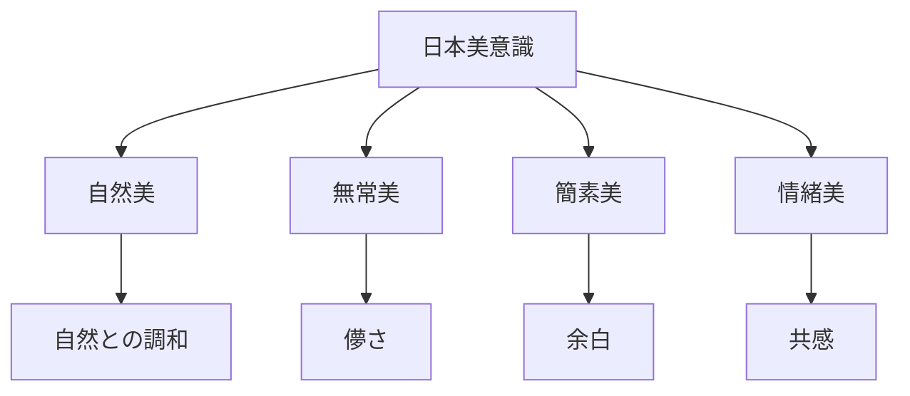
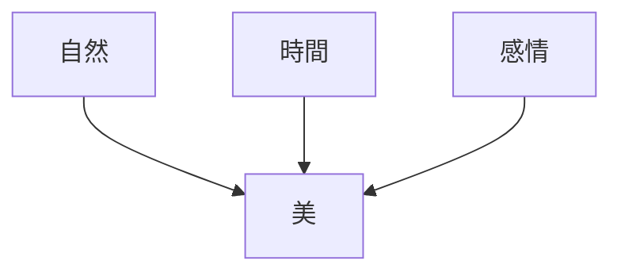
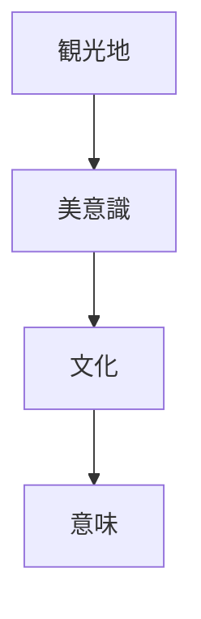

# Japan Aesthetics

Japan Aesthetics は、日本文化における美意識の構造を説明するモデルである。

日本の美意識は

- 自然
- 無常
- 簡素

などの価値観から形成されている。

---

# 核心

日本の美は

**自然と時間の変化を感じる美**

である。

---

# 基本構造

---

# 美意識要素

## 自然美

自然の景観や素材を尊重する美。

例

- 庭園
- 山水画
- 建築

---

## 無常美

時間の変化を感じる美。

例

- 桜
- 落葉
- 古寺

---

## 簡素美

装飾よりも

- シンプルさ
- 静けさ

を重視する。

例

- 茶室
- 禅庭園

---

## 情緒美

感情的共感を重視する美。

例

- 和歌
- 俳句
- 文学

---

# 美意識構造

---

# 文化への影響

## 建築

日本建築では

- 木材
- 自然光
- 空間

など自然との調和が重視される。

---

## 芸術

日本芸術では

- 余白
- 静けさ

が重要な表現となる。

---

## 文学

文学では

- 季節
- 人生

などの情緒が描かれる。

---

# 観光説明での使い方

---

# 例

## 京都庭園

WHAT  
日本庭園

HOW  
自然を模した景観

WHY  
自然美を重視する文化のため

---

## 茶室

WHAT  
茶室

HOW  
小さく簡素な建築

WHY  
簡素美を重視する美意識のため

---

# 一言で言うと

日本の美は

**自然・時間・感情の調和から生まれる。**