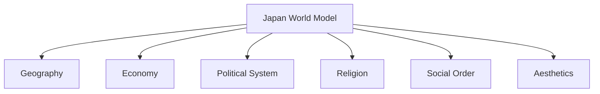
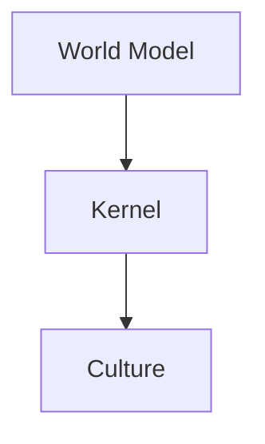
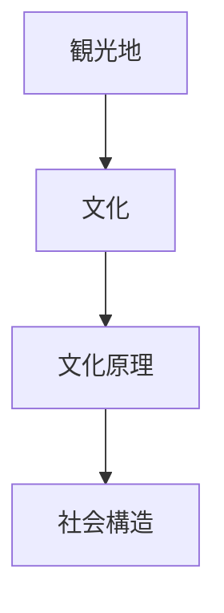

# Japan World Model

Japan World Model は、日本文化が成立する社会構造を説明するモデルである。

このモデルは

- 地理
- 経済
- 政治
- 宗教
- 社会
- 美意識

などの構造から日本文化を理解する。

---

# 構造

---

# 各要素

## Geography

日本列島の地理構造

- 島国
- 山地国家
- 多雨気候
- 災害

リンク

[[Japan Geography]]

---

## Economy

生活と生産の構造

- 稲作
- 都市経済
- 商業文化

リンク

[[Japan Economy]]

---

## Political System

政治制度

- 朝廷
- 武家政権
- 官僚国家

リンク

[[Japan Political System]]

---

## Religion

宗教体系

- 神道
- 仏教
- 神仏習合

リンク

[[Japan Religion]]

---

## Social Order

社会秩序

- 家制度
- 身分
- 共同体

リンク

[[Japan Social Order]]

---

## Aesthetics

美意識

- わび
- さび
- もののあわれ
- 間

リンク

[[Japan Aesthetics]]

---

# World Model と Kernel

World Model は文化の環境であり、Kernel は文化の原理である。

---

# 観光説明との関係

観光地を説明する際は次の順序になる。

---

# このモデルの役割

この World Model により

- 日本文化
- 日本史
- 観光地

を一つの構造として理解できる。

---

# 関連ノート

- [[00 Japanese Culture Kernel]]
- [[Japanese History]]
- [[Tourism Explanation Structure]]