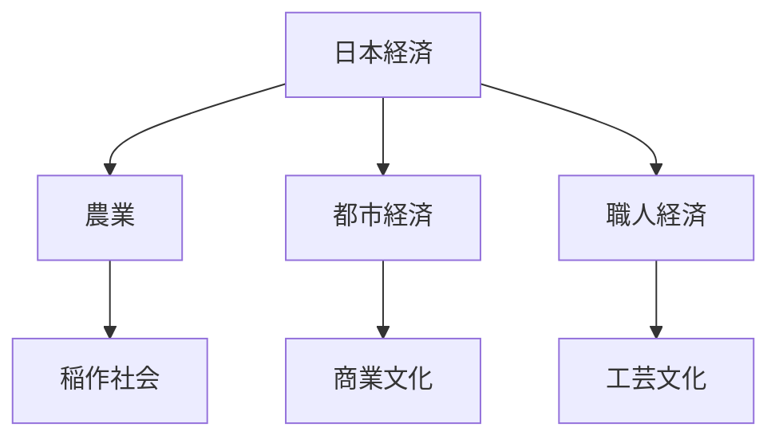
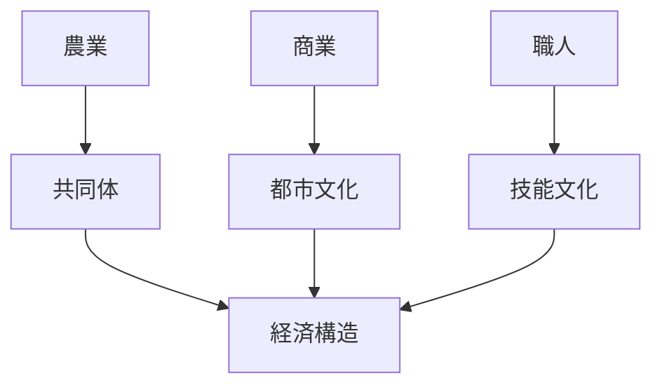
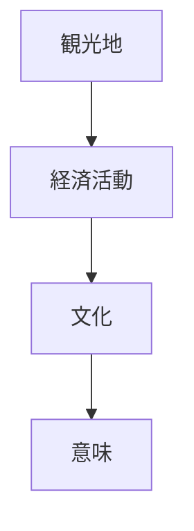

# Japan Economy

Japan Economy は、日本文化を形成してきた経済構造を説明するモデルである。

日本の経済は歴史的に

- 稲作農業
- 都市商業
- 職人経済

など複数の経済体系によって構成されてきた。

---

# 核心

日本経済の基盤は

**稲作社会と都市商業の結合**

である。

---

# 基本構造

---

# 経済要素

## 農業

日本の伝統経済の中心。

特徴

- 水田稲作
- 集団労働
- 季節労働

稲作は

- 共同体
- 村社会

を形成した。

---

## 都市経済

江戸時代以降、都市商業が発展した。

特徴

- 市場
- 商人文化
- 流通ネットワーク

都市は文化の中心となる。

---

## 職人経済

都市では

- 職人
- 工芸

などの専門技術が発展した。

例

- 陶器
- 漆器
- 刀

---

# 経済構造

---

# 文化への影響

## 稲作文化

稲作は

- 季節行事
- 共同体文化

に影響した。

---

## 商人文化

都市では

- 浮世絵
- 歌舞伎
- 娯楽

など町人文化が発展した。

---

## 工芸文化

職人は

- 技術
- 美意識

を発展させた。

---

# 観光説明での使い方

---

# 例

## 江戸

WHAT  
江戸

HOW  
巨大都市

WHY  
商業と流通の中心だったため

---

## 伝統工芸

WHAT  
陶器

HOW  
職人技術

WHY  
職人経済が発展したため

---

# 一言で言うと

日本文化は

**稲作社会と都市商業が作った文化である。**