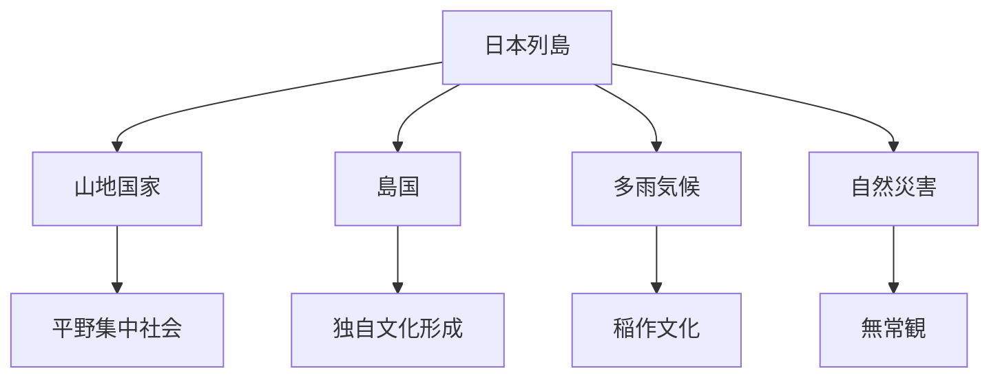
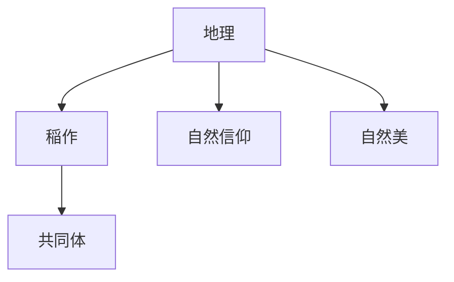
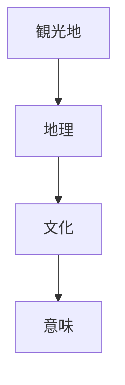

# Japan Geography

Japan Geography は、日本文化を形成した地理的条件を説明するモデルである。

日本文化の多くは

- 島国
- 山地
- 気候
- 自然災害

などの地理条件から強い影響を受けている。

---

# 核心

日本文化は

**列島環境への適応**

として形成された。

---

# 基本構造

---

# 地理要素

## 島国

日本は海に囲まれた列島国家である。

影響

- 外来文化は海を通じて流入
- 国内文化の独自発展
- 海洋交通

---

## 山地国家

日本は国土の約70%が山地である。

影響

- 平野への人口集中
- 小規模共同体
- 地域文化

---

## 多雨気候

日本は降水量が多く、河川が短い。

影響

- 水田稲作
- 森林文化
- 水管理社会

---

## 自然災害

日本では

- 地震
- 台風
- 洪水
- 火山

などが多い。

影響

- 無常観
- 建築様式
- 災害適応文化

---

# 地理と文化

---

# 文化への影響

## 稲作文化

水田稲作は

- 共同作業
- 水管理

を必要とする。

---

## 自然信仰

山や森は

- 神聖な場所
として理解される。

---

## 景観文化

自然景観は

- 庭園
- 文学
- 観光

などの文化に影響する。

---

# 観光説明での使い方

---

# 例

## 富士山

WHAT  
富士山

HOW  
日本最高峰の山

WHY  
日本の自然環境と信仰文化を象徴する存在であるため

---

## 棚田

WHAT  
棚田

HOW  
山地に作られた水田

WHY  
山地国家の地理条件に適応した農業形態であるため

---

# 一言で言うと

日本文化は

**列島環境への適応として生まれた。**