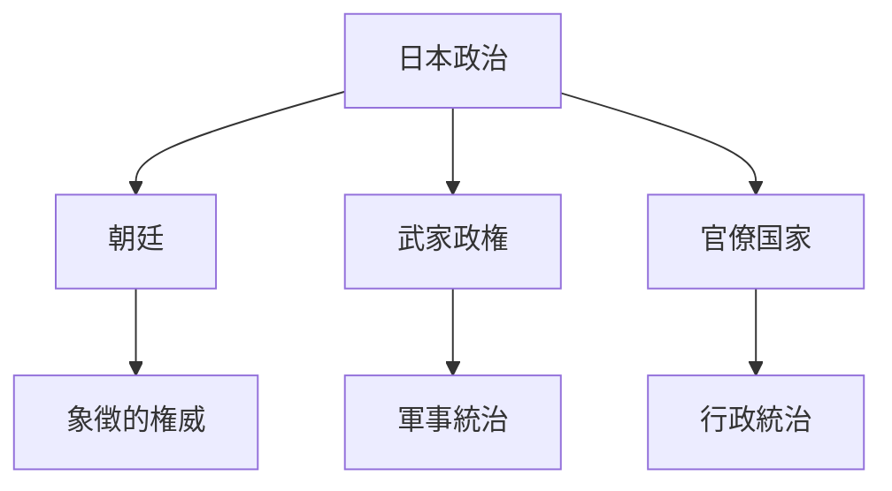
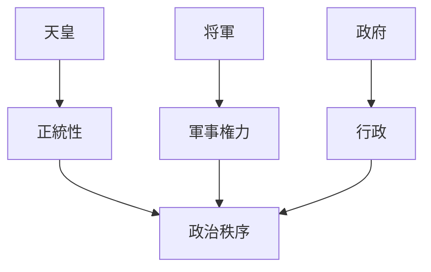
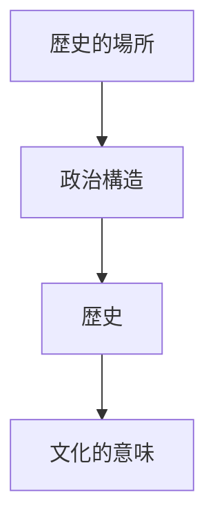

# Japan Political System

Japan Political System は、日本の政治権力構造を説明するモデルである。

日本の政治は歴史的に

- 朝廷
- 武家政権
- 官僚国家

など複数の権力体系が重なり合う形で成立してきた。

---

# 核心

日本政治の特徴は

**象徴的権威と実際の統治権が分離すること**

である。

---

# 基本構造

---

# 政治要素

## 朝廷

天皇を中心とする政治体系。

特徴

- 神話的正統性
- 象徴的権威
- 文化的中心

---

## 武家政権

武士による統治。

例

- 鎌倉幕府
- 室町幕府
- 江戸幕府

特徴

- 軍事権力
- 主従関係

---

## 官僚国家

近代以降の政治体制。

特徴

- 法制度
- 行政機構
- 官僚組織

---

# 権力構造

---

# 文化への影響

## 権威

日本社会では

- 皇室
- 伝統

などが権威の源となる。

---

## 武士文化

武士社会は

- 忠義
- 主従関係

を中心とした政治文化を形成した。

---

## 近代国家

明治以降、日本は

- 近代国家制度
- 官僚制

を導入した。

---

# 観光説明での使い方

---

# 例

## 京都御所

WHAT  
京都御所

HOW  
天皇の居所

WHY  
日本政治の象徴的権威の中心だったため

---

## 江戸城

WHAT  
江戸城

HOW  
徳川幕府の政治拠点

WHY  
武家政権の中心だったため

---

# 一言で言うと

日本政治は

**象徴権威と統治権が分離する政治構造である。**