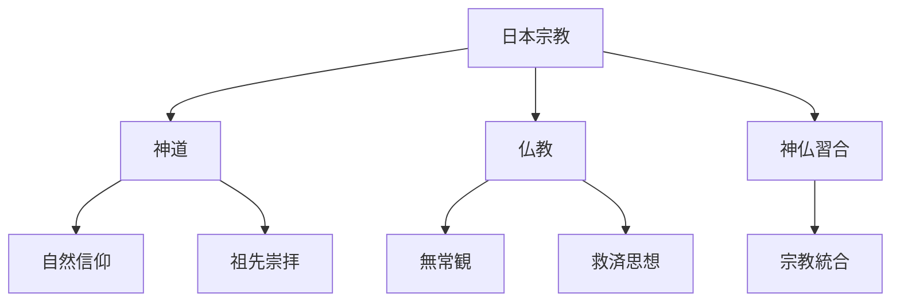
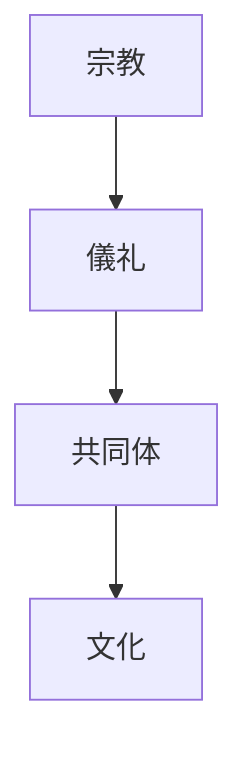
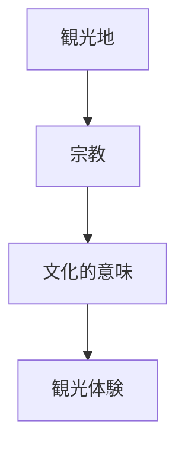

# Japan Religion

Japan Religion は、日本文化における宗教構造を説明するモデルである。

日本の宗教は

- 神道
- 仏教
- 神仏習合

など複数の宗教体系が重なり合う形で成立している。

---

# 核心

日本宗教の特徴は

**排他的な宗教ではなく、重層的宗教構造**

である。

---

# 基本構造

---

# 宗教要素

## 神道

日本固有の宗教。

特徴

- 自然信仰
- 神の存在
- 祖先崇拝

神は

- 山
- 森
- 海
- 祖先

などに宿ると考えられる。

---

## 仏教

6世紀に伝来。

主な思想

- 無常
- 輪廻
- 解脱

日本では多くの宗派が成立した。

---

## 神仏習合

神道と仏教が統合した宗教形態。

例

- 神宮寺
- 本地垂迹思想

---

# 宗教と社会

---

# 文化への影響

## 神社

神道の聖地。

特徴

- 鳥居
- 神体
- 祭礼

---

## 寺院

仏教の修行と信仰の場。

特徴

- 仏像
- 禅
- 宗派

---

## 祭礼

宗教儀礼は地域共同体の中心となる。

---

# 観光説明での使い方

---

# 例

## 伊勢神宮

WHAT  
神社

HOW  
天照大神を祀る

WHY  
日本神話と皇室の宗教的中心であるため

---

## 東大寺

WHAT  
仏教寺院

HOW  
奈良時代に建立

WHY  
国家仏教の中心として建設されたため

---

# 一言で言うと

日本宗教は

**神道と仏教が重なって存在する宗教文化である。**