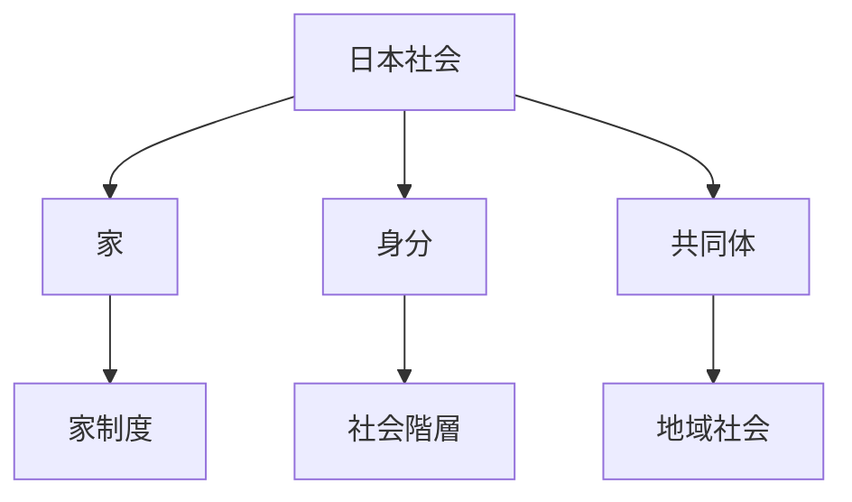
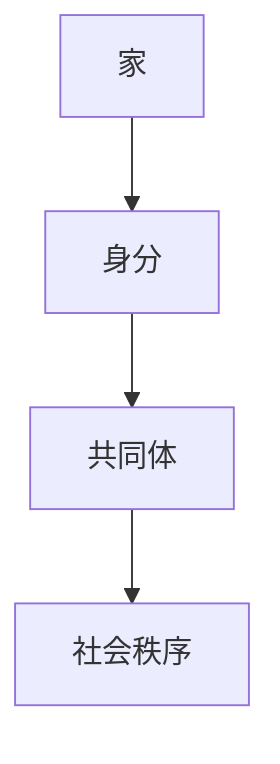
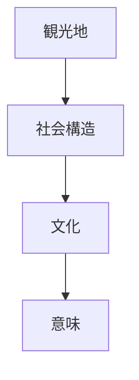

# Japan Social Order

Japan Social Order は、日本社会の基本構造を説明するモデルである。

日本社会は

- 家
- 身分
- 共同体

などの社会単位によって構成されてきた。

---

# 核心

日本社会では

**個人よりも関係と役割**

が社会秩序の基礎となる。

---

# 基本構造

---

# 社会要素

## 家

日本社会では家が基本単位である。

特徴

- 家長
- 家系
- 先祖

家は単なる家族ではなく  
**社会単位**として理解される。

---

## 身分

歴史的には

- 武士
- 農民
- 職人
- 商人

などの身分秩序が存在した。

---

## 共同体

地域社会では

- 村
- 町
- 地域組織

などの共同体が重要な役割を持つ。

---

# 社会構造

---

# 文化への影響

## 礼儀

社会秩序を維持するため

- 敬語
- 礼儀

が発達した。

---

## 役割

社会では

- 役割
- 立場

が重視される。

---

## 共同活動

地域では

- 祭礼
- 行事

が共同体を維持する。

---

# 観光説明での使い方

---

# 例

## 祭り

WHAT  
祭り

HOW  
地域住民が共同で実施

WHY  
共同体が社会の基本単位であるため

---

## 武家社会

WHAT  
武士制度

HOW  
主従関係と身分秩序

WHY  
社会を階層構造で維持していたため

---

# 一言で言うと

日本社会は

**家・身分・共同体で構成される。**