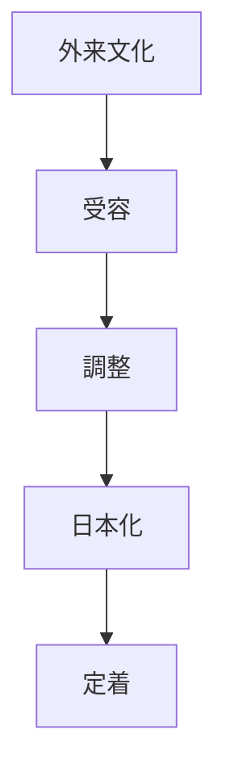
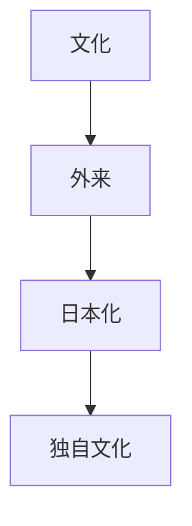

# 適応原理  
Adaptation

適応原理とは、  
**外来文化や新しい技術をそのまま受け入れるのではなく、日本社会に合わせて変化させる日本文化の原理**である。

日本文化では

- 外来制度
- 宗教
- 技術
- 文化

がそのまま移植されるのではなく、

**日本的に再構成**

される。

---

# 核心

外来文化は

- 模倣
ではなく

**適応**

によって定着する。

---

# 背景

## 地理

日本は島国であり、

- 外来文化が段階的に流入
- 国内社会は比較的安定

という条件があった。

---

## 歴史

日本は

- 中国文化
- 西洋文化

などを受容してきた。

しかしその多くは

**日本化**

されている。

---

## 社会構造

社会秩序を維持するため、  
新しい制度は既存の構造に合わせて調整される。

---

# 構造

---

# 文化への影響

## 宗教

仏教は

- インド
- 中国

から伝来したが、日本独自の宗派が生まれた。

---

## 政治制度

日本は

- 律令制度
- 近代国家制度

などを取り入れたが、日本社会に合わせて調整された。

---

## 生活文化

食文化でも

- ラーメン
- カレー

など外来料理が日本化している。

---

# 観光説明での使い方

---

# 例

## 仏教

WHAT  
仏教

HOW  
日本で独自の宗派が発展

WHY  
外来宗教を日本社会に適応させたため

---

## ラーメン

WHAT  
ラーメン

HOW  
中国料理が日本化

WHY  
外来文化を適応させる文化があるため

---

# 他のKernelとの関係

- [[Syncretism]]
- [[Continuity]]
- [[Craftsmanship]]

---

# 一言で言うと

日本文化では

**外来文化は日本化される。**