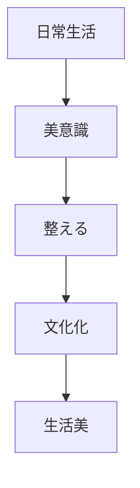
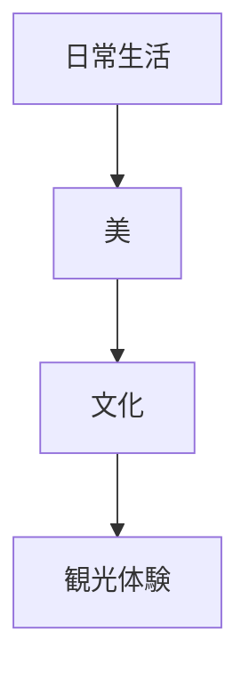

# 生活美原理  
Aestheticization of Life

生活美原理とは、  
**日常生活そのものを美的に整え、生活行為を文化として昇華する日本文化の原理**である。

日本文化では

- 食事
- 住居
- 行事
- 道具

など日常生活の多くの要素が

**美の対象**

となる。

---

# 核心

美は

- 特別な芸術
だけではなく

**日常生活の中に存在する。**

---

# 背景

## 農村社会

農村生活では

- 季節
- 自然

と密接に結びついた生活が営まれてきた。

---

## 芸道文化

日本では

- 茶道
- 華道
- 書道

など、日常行為が芸術化される傾向がある。

---

## 職人文化

道具や生活用品も

- 美しさ
- 技術

が重視される。

---

# 構造

---

# 文化への影響

## 食文化

日本料理では

- 盛り付け
- 季節感

が重要である。

---

## 住居

日本の住居では

- 庭
- 空間

など生活空間が美として整えられる。

---

## 道具

日用品でも

- 陶器
- 漆器

など美しいものが多い。

---

# 観光説明での使い方

---

# 例

## 和食

WHAT  
和食

HOW  
盛り付けや季節感を重視する

WHY  
日常生活そのものを美として整える文化があるため

---

## 茶道

WHAT  
茶道

HOW  
日常の茶を芸術化する

WHY  
生活行為を文化として昇華するため

---

# 他のKernelとの関係

- [[Minimalism]]
- [[Seasonal Sensibility]]
- [[Craftsmanship]]

---

# 一言で言うと

日本文化では

**生活そのものが芸術になる。**