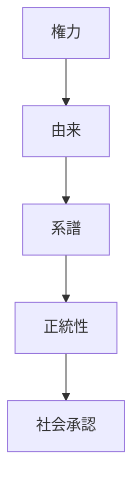
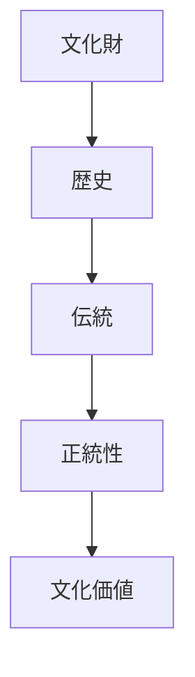

# 正統性原理  
Authority and Legitimacy

正統性原理とは、  
**権威や権力が歴史・伝統・血統などの連続性によって正当化される日本文化の原理**である。

日本社会では権威は単なる力ではなく、

- 由来
- 歴史
- 系譜

などによって正当化される。

---

# 核心

権威は

- 力
だけでなく

**正統な由来**

によって成立する。

---

# 背景

## 天皇制度

日本では

- 天皇
- 皇統

が長く続いている。

この連続性が政治的正統性の源となった。

---

## 武家政権

将軍も

- 朝廷の権威
- 任命

によって正統性を得た。

---

## 家制度

家の継承では

- 血統
- 先祖

が重要視される。

---

# 構造

---

# 文化への影響

## 皇室

皇室は

- 日本神話
- 皇統

によって正統性を持つ。

---

## 武家社会

武士の権威も

- 主従関係
- 家系

によって支えられた。

---

## 伝統文化

多くの文化では

- 家元制度
- 流派

などが正統性を示す。

---

# 観光説明での使い方

---

# 例

## 伊勢神宮

WHAT  
伊勢神宮

HOW  
天照大神を祀る神社

WHY  
皇室の祖先神を祀ることで日本の正統性を象徴するため

---

## 家元制度

WHAT  
茶道の家元

HOW  
家系によって継承される

WHY  
文化の正統な継承を示すため

---

# 他のKernelとの関係

- [[Hierarchy]]
- [[Narrative Tradition]]
- [[Continuity]]

---

# 一言で言うと

日本文化では

**権威は歴史から生まれる。**