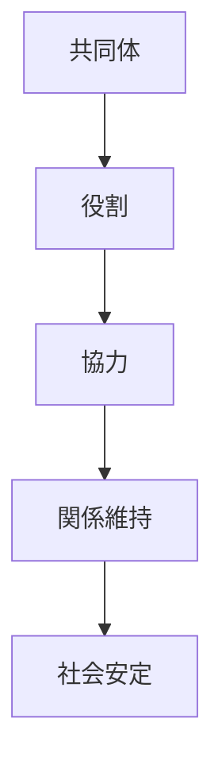
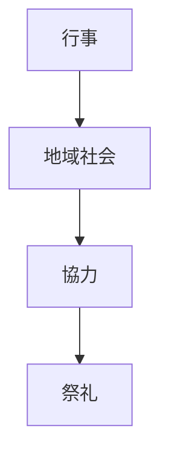

# 共同体原理  
Community Orientation

共同体原理とは、  
**個人よりも集団や共同体を重視する日本文化の原理**である。

日本社会では個人が完全に独立した存在として行動するより、

- 家
- 村
- 組織
- 地域

などの共同体の中で役割を持つことが重要視される。

---

# 核心

日本文化では

- 個人
より

**関係**

が重視される。

人は

- 家族
- 地域
- 組織

などの共同体の一員として理解される。

---

# 背景

## 農村社会

稲作社会では

- 水管理
- 労働
- 収穫

などが共同作業で行われた。

そのため共同体の協力が不可欠だった。

---

## 地理

日本は

- 山地が多い
- 集落が分散する

ため、小さな共同体が発達した。

---

## 社会制度

歴史的には

- 家制度
- 村落共同体

が社会の基本単位だった。

---

# 構造

---

# 文化への影響

## 祭礼

祭りは

- 地域住民
- 共同作業

によって運営される。

---

## 組織文化

企業では

- チーム
- 集団意思決定

が重視される。

---

## 社会行動

人は

- 周囲との関係
- 集団の調和

を意識して行動する。

---

# 観光説明での使い方

---

# 例

## 祭り

WHAT  
祭り

HOW  
地域住民が共同で準備する

WHY  
共同体が社会の基本単位であるため

---

## 町内会

WHAT  
地域組織

HOW  
住民が共同で地域を管理する

WHY  
共同体を重視する社会文化があるため

---

# 他のKernelとの関係

- [[Harmony]]
- [[Hierarchy]]
- [[Ritualization]]

---

# 一言で言うと

日本文化では

**人は個人ではなく共同体の一員として存在する。**