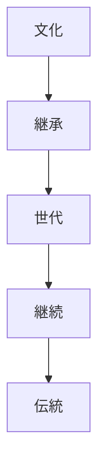
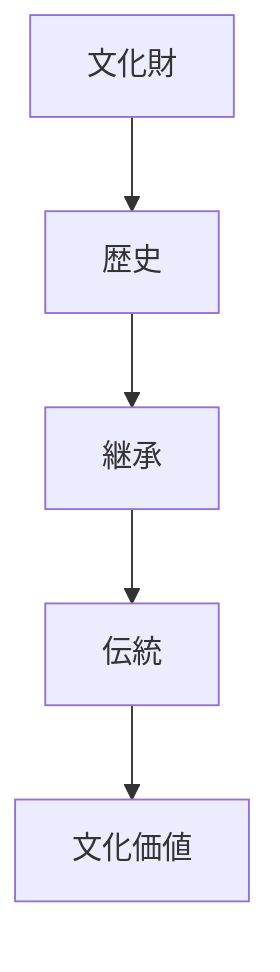

# 継続原理  
Continuity

継続原理とは、  
**制度・文化・技術を長い時間をかけて継承し続ける日本文化の原理**である。

日本文化では

- 家系
- 技術
- 宗教
- 行事

などが世代を超えて継続することが重視される。

---

# 核心

文化の価値は

- 新しさ
より

**継続**

によって高まる。

---

# 背景

## 社会構造

日本社会では

- 家制度
- 血統

が重要であり、社会秩序が世代継承によって維持された。

---

## 宗教

神社や祭礼は

- 数百年
- 数千年

続くものが多い。

---

## 技術

職人技術は

- 師匠
- 弟子

の関係で継承される。

---

# 構造

---

# 文化への影響

## 皇室

日本の皇室は世界でも最も長い歴史を持つ王統とされる。

---

## 神社

多くの神社は

- 長い歴史
- 継続した祭礼

を持つ。

---

## 伝統文化

多くの文化では

- 流派
- 家元

などが継続を担う。

---

# 観光説明での使い方

---

# 例

## 伊勢神宮

WHAT  
伊勢神宮

HOW  
20年ごとに式年遷宮を行う

WHY  
神社の形を世代ごとに継続する文化があるため

---

## 祭礼

WHAT  
祭り

HOW  
地域で何百年も続く

WHY  
文化を継承する社会構造があるため

---

# 他のKernelとの関係

- [[Authority and Legitimacy]]
- [[Craftsmanship]]
- [[Adaptation]]

---

# 一言で言うと

日本文化では

**文化は続くことで価値を持つ。**