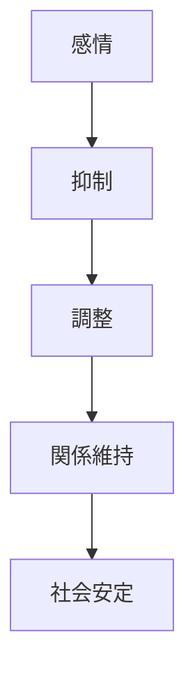
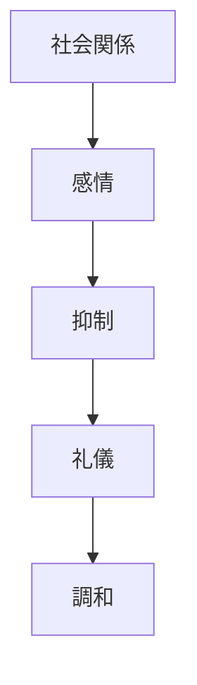

# 感情制御原理  
Controlled Emotion

感情制御原理とは、  
**個人の感情を直接的に表現するよりも、状況や関係に応じて抑制・調整する日本文化の原理**である。

日本社会では

- 感情の自由表現
より

**関係維持**

が優先される。

---

# 核心

人は

- 本音
と
- 建前

を使い分けることで社会関係を維持する。

---

# 背景

## 共同体社会

小さな共同体では

- 対立
- 衝突

が社会秩序を崩す可能性がある。

そのため感情の抑制が重要になる。

---

## 和の文化

日本社会では

- 和
- 調和

が重視される。

---

## 社会関係

上下関係や集団関係の中で

- 礼儀
- 配慮

が重要となる。

---

# 構造

---

# 文化への影響

## 本音と建前

日本社会では

- 本音（内心）
- 建前（社会的表現）

が区別される。

---

## 礼儀

礼儀や敬語は

- 感情表現
を調整する役割を持つ。

---

## 集団行動

集団の中では

- 個人主張
より
- 協調

が重視される。

---

# 観光説明での使い方

---

# 例

## 接客

WHAT  
日本の接客

HOW  
礼儀正しく丁寧

WHY  
感情より関係維持を重視する文化があるため

---

## 本音と建前

WHAT  
本音と建前

HOW  
内心と社会表現を分ける

WHY  
社会関係を円滑にするため

---

# 他のKernelとの関係

- [[Harmony]]
- [[Hierarchy]]
- [[Community Orientation]]

---

# 一言で言うと

日本文化では

**感情は調整される。**