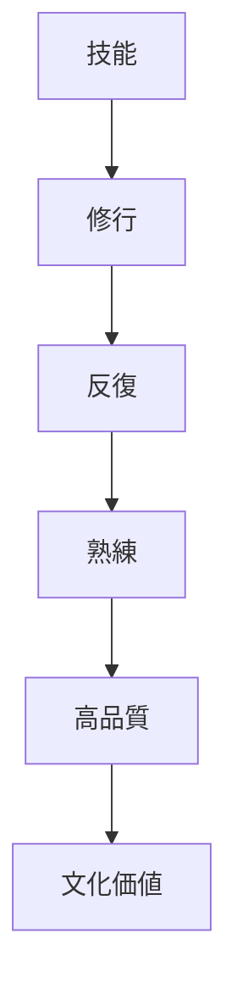
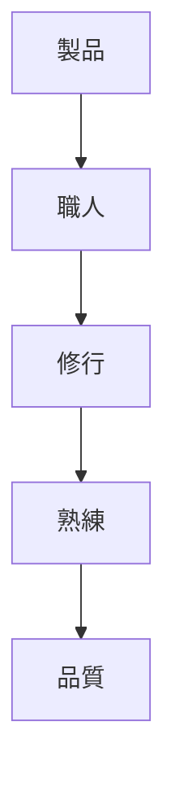

# 職人精神原理  
Craftsmanship

職人精神原理とは、  
**技術を長期間の修練によって極限まで高める日本文化の原理**である。

日本文化では

- 技能
- 作業
- 手仕事

が単なる労働ではなく

**人格形成や精神修養**

と結びつく。

---

# 核心

職人文化では

- 長い修行
- 細部へのこだわり
- 完成度の追求

が重視される。

---

# 背景

## ギルド的社会

江戸時代には

- 大工
- 刀鍛冶
- 漆職人

など専門職が高度に発達した。

---

## 道の文化

日本では技術が

- 茶道
- 武道
- 書道

のように

**道（修行体系）**

として理解される。

---

## 世代継承

技能は

- 師匠
- 弟子

の関係で継承される。

---

# 構造

---

# 文化への影響

## 工芸

日本では

- 漆器
- 陶器
- 刀

など工芸技術が高度に発達した。

---

## 食文化

寿司や和食では

- 包丁技術
- 調理技術

が重要視される。

---

## 建築

日本の大工は

- 木工技術
- 継手技術

など高度な技能を持つ。

---

# 観光説明での使い方

---

# 例

## 日本刀

WHAT  
日本刀

HOW  
鍛造と研磨を繰り返して作る

WHY  
技能を長年の修練で高める文化があるため

---

## 寿司

WHAT  
寿司

HOW  
職人が長年修行する

WHY  
技術を極める文化があるため

---

# 他のKernelとの関係

- [[Embodied Practice]]
- [[Ritualization]]
- [[Continuity]]

---

# 一言で言うと

日本文化では

**技能は人生をかけて磨くもの。**