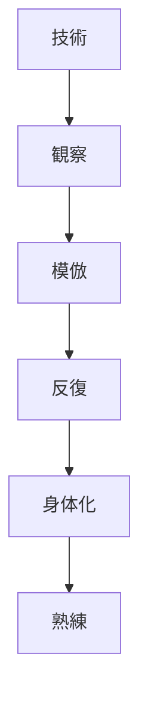
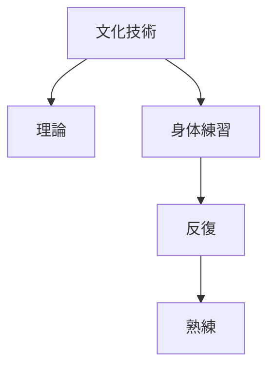

# 身体知原理  
Embodied Practice

身体知原理とは、  
**知識や技術が言語や理論よりも身体的実践を通じて習得されるという日本文化の原理**である。

日本文化では

- 技術
- 芸術
- 武術
- 礼儀

など多くの領域で

**体で覚える**

という学習方法が重視される。

---

# 核心

知識は

- 理論で理解する
だけでなく

**身体の動きとして習得する**

ことで完成する。

---

# 背景

## 師弟制度

伝統文化では

- 師匠
- 弟子

の関係で技能が伝えられる。

このとき

- 観察
- 模倣
- 反復

によって技能が身につく。

---

## 道の文化

日本では

- 武道
- 茶道
- 書道
- 華道

など、技能が

**修行の道**

として理解される。

---

## 暗黙知

日本文化では

- 言葉で説明できない技能
- 感覚的理解

が重要視される。

---

# 構造

---

# 文化への影響

## 武道

武道では

- 型
- 反復練習

を通じて身体が技術を覚える。

---

## 茶道

茶道では

- 手の動き
- 歩き方
- 道具の扱い

などが身体的に習得される。

---

## 伝統芸能

能や歌舞伎では

- 動き
- 姿勢

などが身体訓練によって身につく。

---

# 観光説明での使い方

---

# 例

## 武道

WHAT  
武道

HOW  
型の反復練習

WHY  
技術を身体で覚える文化があるため

---

## 茶道

WHAT  
茶道

HOW  
動作を身体で覚える

WHY  
技能は身体的実践によって習得されるため

---

# 他のKernelとの関係

- [[Craftsmanship]]
- [[Ritualization]]
- [[Continuity]]

---

# 一言で言うと

日本文化では

**知識は体で覚える。**