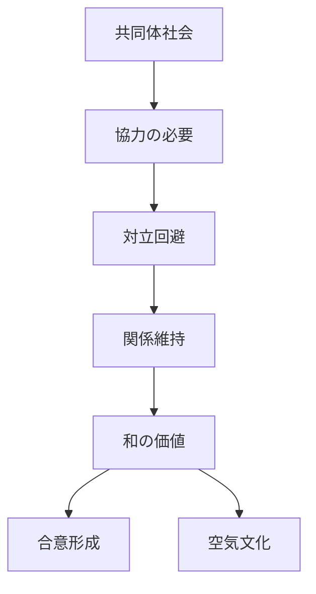
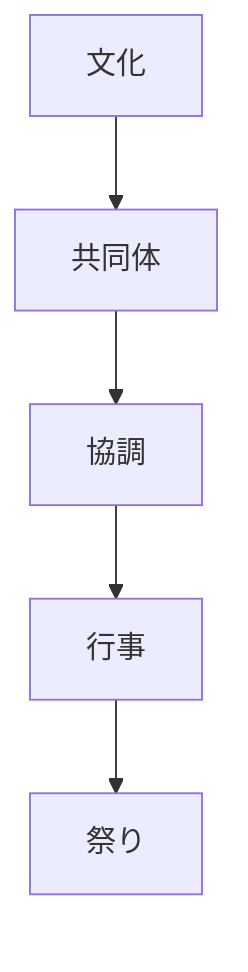

# 和原理  
Harmony

和原理とは、  
**社会において対立よりも調和を優先する日本文化の原理**である。

日本社会では個人の主張より

- 集団の安定
- 関係維持
- 空気の共有

が重視される。

---

# 核心

和とは

- 衝突を避ける
- 関係を維持する
- 協調を優先する

という社会原理である。

---

# 背景

## 農村共同体

稲作社会では

- 水管理
- 労働協力
- 村の秩序

が不可欠だった。

このため対立より

**協調**

が重要だった。

---

## 島国社会

地理的に閉じた社会では

- 逃げ場が少ない
- 長期関係が続く

ため、関係維持が重視される。

---

## 政治文化

日本の政治文化では

- 合議
- 根回し
- 妥協

などが発達した。

---

# 構造

---

# 文化への影響

## 社会行動

例

- 根回し
- 空気を読む
- 場の調和

---

## 組織文化

日本企業では

- 合議制
- チーム重視
- 長期関係

が重視される。

---

## 祭礼

祭りは

- 共同作業
- 共同体参加

を通じて  
和を強化する。

---

# 観光説明での使い方

---

# 例

## 祭り

WHAT  
祭り

HOW  
地域住民が共同で実施

WHY  
共同体の調和を維持する文化があるため

---

## 合議

WHAT  
合議制

HOW  
多数の人が話し合う

WHY  
対立よりも調和を重視する社会文化があるため

---

# 他のKernelとの関係

- [[Community Orientation]]
- [[Hierarchy]]
- [[Ritualization]]

---

# 一言で言うと

日本社会では

**正しさより調和が優先される。**