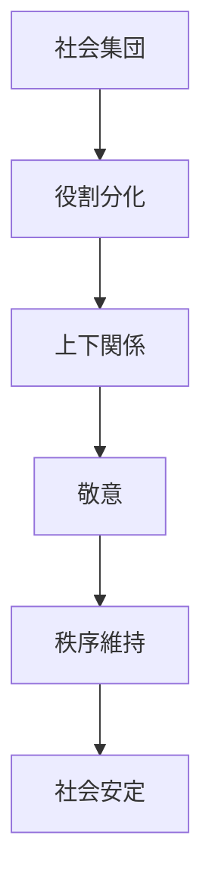
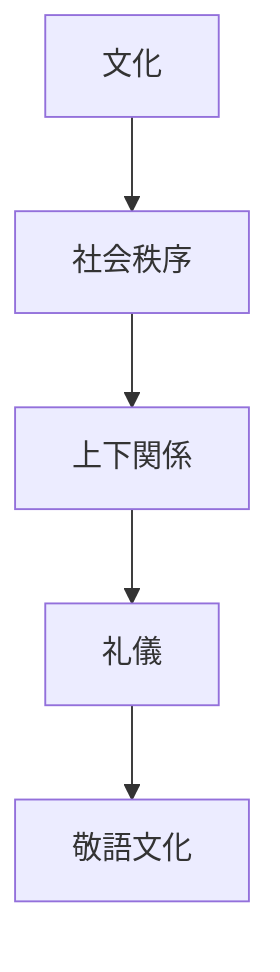

# 階層秩序原理  
Hierarchy

階層秩序原理とは、  
**社会が上下関係と役割の秩序によって安定するという日本文化の原理**である。

日本社会では個人が完全に平等な存在として振る舞うより、

- 年齢
- 身分
- 地位
- 役割

によって関係が整理される傾向がある。

---

# 核心

日本社会では

- 上下関係
- 役割
- 敬意

によって社会秩序が維持される。

これは単なる権力関係ではなく

**社会秩序を保つための構造**

として理解される。

---

# 背景

## 家制度

日本社会では

- 家長
- 親子
- 先祖

など、家を単位とした秩序が重要だった。

---

## 武家社会

武士社会では

- 主君
- 家臣

の関係が社会秩序の基盤だった。

---

## 年齢秩序

日本社会では

- 先輩
- 後輩

など、年齢による秩序が広く存在する。

---

# 構造

---

# 文化への影響

## 礼儀

日本文化では

- 敬語
- 礼儀作法

が発達した。

---

## 組織

企業や学校では

- 先輩
- 後輩
- 上司
- 部下

という関係が明確である。

---

## 家制度

歴史的には

- 家長
- 家族

という秩序が社会の基本単位だった。

---

# 観光説明での使い方

---

# 例

## 敬語

WHAT  
敬語

HOW  
相手との関係で言葉が変わる

WHY  
社会が上下関係によって秩序化されているため

---

## 武士社会

WHAT  
主従関係

HOW  
主君と家臣の関係

WHY  
社会秩序を維持するための階層構造があったため

---

# 他のKernelとの関係

- [[Harmony]]
- [[Community Orientation]]
- [[Authority and Legitimacy]]

---

# 一言で言うと

日本社会では

**秩序は上下関係によって維持される。**