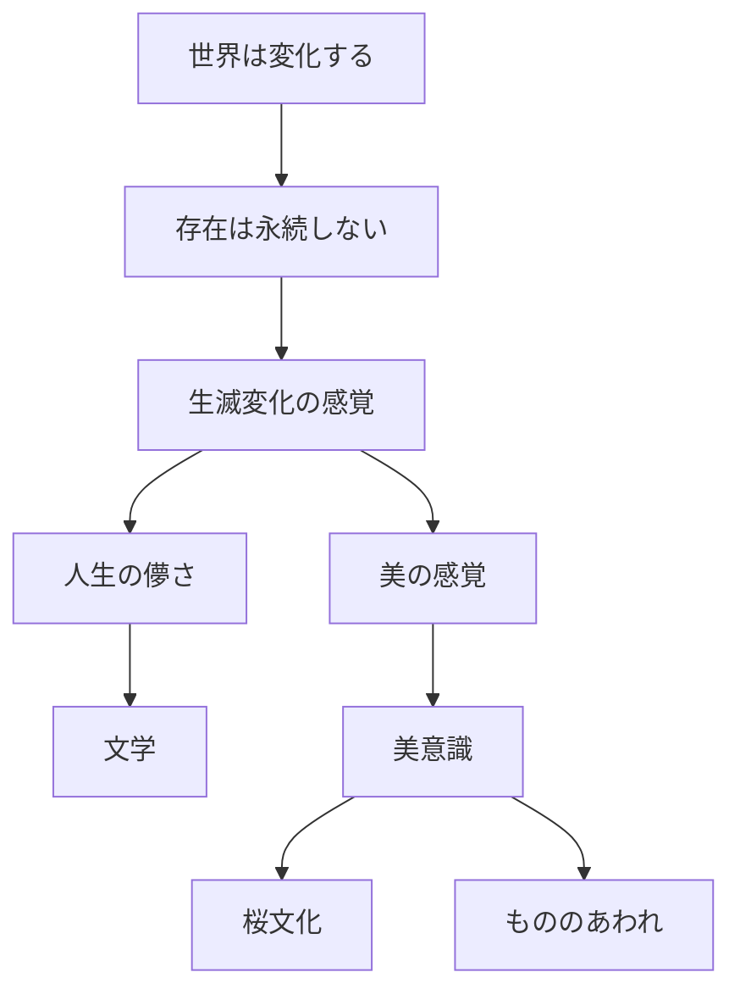
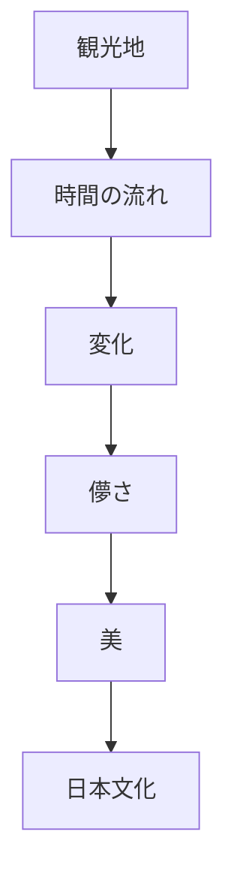

# 無常原理  
Impermanence

無常原理とは、  
**すべての存在は変化し続け、永続するものはないという世界観**である。

この思想は仏教思想と深く結びつき、日本文化の

- 美意識
- 文学
- 武士道
- 芸術
- 季節文化

に強く影響している。

---

# 核心

無常とは

- 生まれる
- 変化する
- 滅びる

という **存在の基本構造**を意味する。

日本文化ではこの変化を

- 悲観
- 諦念

ではなく

**美として感受する文化**

が発達した。

---

# 背景

## 仏教思想

仏教の三法印

- 諸行無常
- 諸法無我
- 涅槃寂静

のうち、日本文化に最も強く影響したのが **諸行無常**である。

---

## 自然環境

日本列島は

- 地震
- 台風
- 洪水
- 火山

など自然変動が大きい。

このため

**世界は安定しない**

という感覚が文化に根付いた。

---

## 歴史

戦乱

- 平安末期
- 戦国時代

など、社会秩序が崩れる経験も  
無常観を強めた。

---

# 構造

---

# 文化への影響

## 文学

例

- 平家物語
- 方丈記
- 徒然草

有名な例

「祇園精舎の鐘の声  
諸行無常の響きあり」

---

## 美意識

無常は

- もののあわれ
- 侘び寂び

と結びつく。

---

## 花見

桜は

- 短期間で散る
- 満開が短い

ため、日本文化では

**美と無常の象徴**

になった。

---

## 武士文化

武士道では

- 死を覚悟する
- 名誉を重視する

という思想が無常観と結びつく。

---

# 観光説明での使い方

---

# 例

## 桜

WHAT  
桜

HOW  
短期間で開花し散る

WHY  
日本文化では儚さを美として感じるため

---

## 平家物語

WHAT  
軍記物語

HOW  
平家滅亡の物語

WHY  
権力や栄華も永続しないという無常観を表すため

---

# 他のKernelとの関係

- [[Nature Relation]]
- [[Seasonal Sensibility]]
- [[Minimalism]]
- [[Narrative Tradition]]

---

# 一言で言うと

日本文化では

**変化そのものが美になる。**