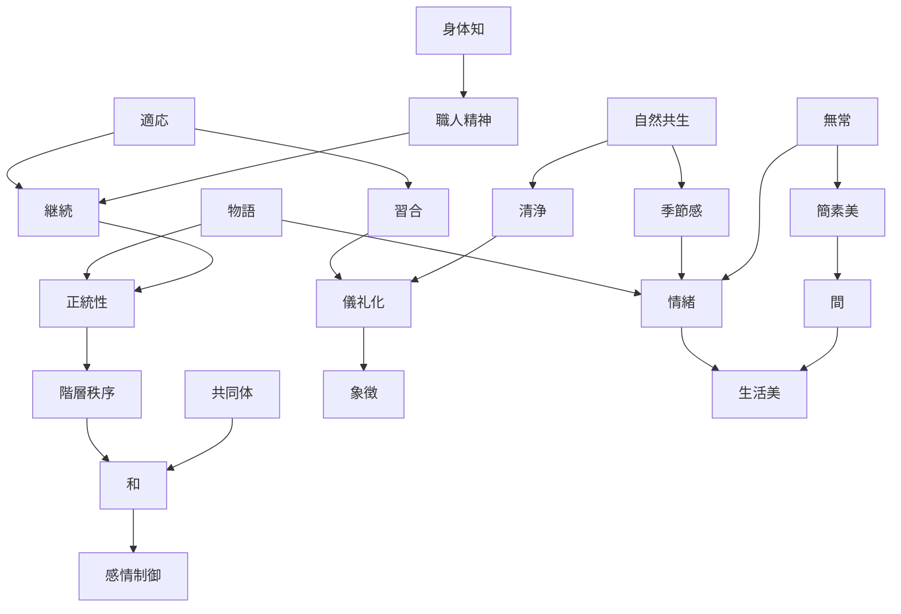

# Japanese Culture Kernel

Japanese Culture Kernel は、日本文化を理解するための **普遍原理（Kernel）** の集合である。

個別の文化・歴史・観光地は、この Kernel の組み合わせとして説明できる。

目的

- 日本文化の理解
- 観光地の WHY 説明
- 文化構造の把握

---

# Kernel 一覧

## 自然と世界観

- [[Nature Relation]]
- [[Impermanence]]
- [[Seasonal Sensibility]]

---

## 社会原理

- [[Harmony]]
- [[Hierarchy]]
- [[Community Orientation]]
- [[Authority and Legitimacy]]

---

## 宗教・精神

- [[Purity and Pollution]]
- [[Syncretism]]
- [[Ritualization]]

---

## 美意識

- [[Minimalism]]
- [[Spatial Awareness]]
- [[Symbolism]]
- [[Aestheticization of Life]]

---

## 文化生成

- [[Craftsmanship]]
- [[Embodied Practice]]
- [[Narrative Tradition]]

---

## 文化進化

- [[Adaptation]]
- [[Continuity]]

---

## 行動様式

- [[Controlled Emotion]]

---

# Kernel の役割

Kernel は次の層で機能する。

---

# Kernel間の関係性

