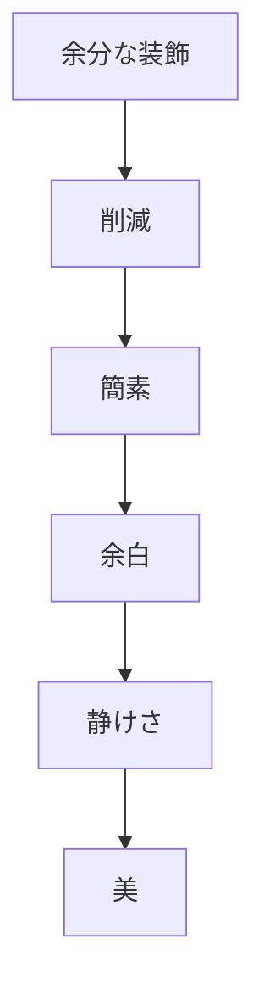
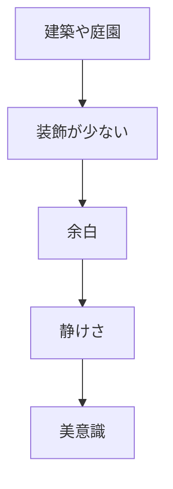

# 簡素美原理  
Minimalism / Wabi-Sabi

簡素美原理とは、  
**過剰な装飾ではなく、簡素・余白・不完全さに美を見出す日本文化の原理**である。

日本の美意識では

- 豪華さ
- 完全さ
- 永続性

よりも

- 簡素
- 静けさ
- 不完全
- 経年変化

が美として評価されることが多い。

---

# 核心

美は

- 足すこと
ではなく

**削ること**

によって現れる。

---

# 背景

## 禅仏教

禅では

- 執着を捨てる
- 本質を残す

という思想が重視される。

---

## 無常観

すべての存在が変化するという思想は

- 古びたもの
- 朽ちたもの

にも美を見出す感覚を生んだ。

---

## 生活文化

日本の住居は

- 小さく
- 木造で
- 自然素材

が中心であり、過剰な装飾が少ない。

---

# 構造

---

# 文化への影響

## 茶道

茶室は

- 小さい
- 装飾が少ない
- 自然素材

で構成される。

---

## 日本庭園

枯山水庭園では

- 石
- 砂

だけで風景を表現する。

---

## 建築

日本建築では

- 余白
- 空間

が重要な美となる。

---

# 観光説明での使い方

---

# 例

## 茶室

WHAT  
茶室

HOW  
小さく簡素な空間

WHY  
簡素な空間に精神的な美を見出す文化があるため

---

## 枯山水庭園

WHAT  
石庭

HOW  
石と砂で景観を表現

WHY  
最小の要素で自然を象徴する美意識があるため

---

# 他のKernelとの関係

- [[Impermanence]]
- [[Spatial Awareness]]
- [[Ritualization]]

---

# 一言で言うと

日本文化では

**美は少なさの中に現れる。**