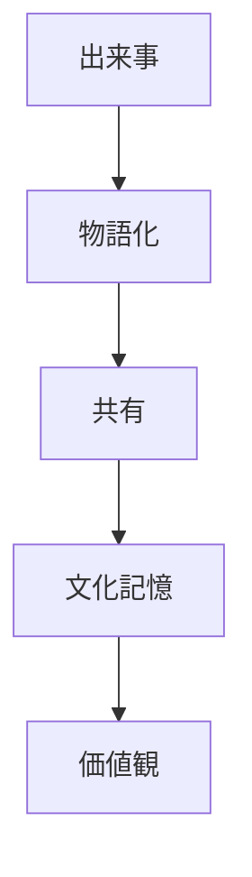
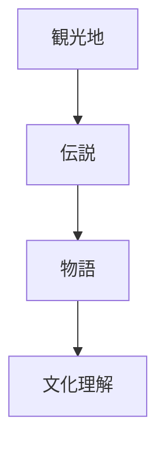

# 物語原理  
Narrative Tradition

物語原理とは、  
**歴史・価値観・文化が物語として語られ共有される日本文化の原理**である。

日本文化では

- 神話
- 伝説
- 歴史物語
- 文学

などを通じて文化が伝承される。

---

# 核心

文化は

- 事実
より

**物語**

として理解され共有される。

---

# 背景

## 神話

日本文化では

- 古事記
- 日本書紀

など神話が文化の基盤となっている。

---

## 歴史文学

歴史は

- 軍記物語
- 説話

として語られてきた。

---

## 社会記憶

物語は

- 集団記憶
- 文化理解

を形成する。

---

# 構造

---

# 文化への影響

## 神話

日本の神話は

- 天皇
- 国家

の起源を説明する。

---

## 軍記物語

歴史は

- 平家物語
- 太平記

など物語として語られる。

---

## 地域伝説

観光地には

- 伝説
- 昔話

が残ることが多い。

---

# 観光説明での使い方

---

# 例

## 出雲神話

WHAT  
出雲大社

HOW  
神話の舞台

WHY  
日本神話の重要な物語が伝わる場所だから

---

## 平家物語

WHAT  
平家物語

HOW  
平家滅亡の物語

WHY  
歴史を物語として共有する文化があるため

---

# 他のKernelとの関係

- [[Symbolism]]
- [[Impermanence]]
- [[Authority and Legitimacy]]

---

# 一言で言うと

日本文化では

**歴史は物語として語られる。**