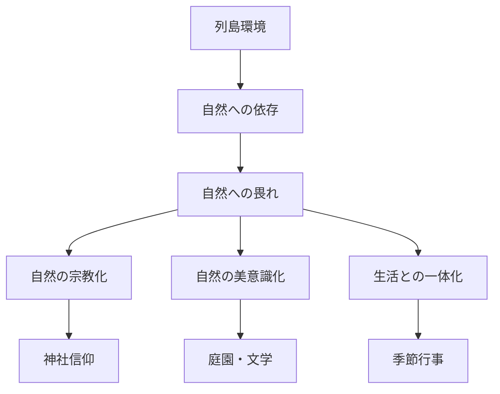
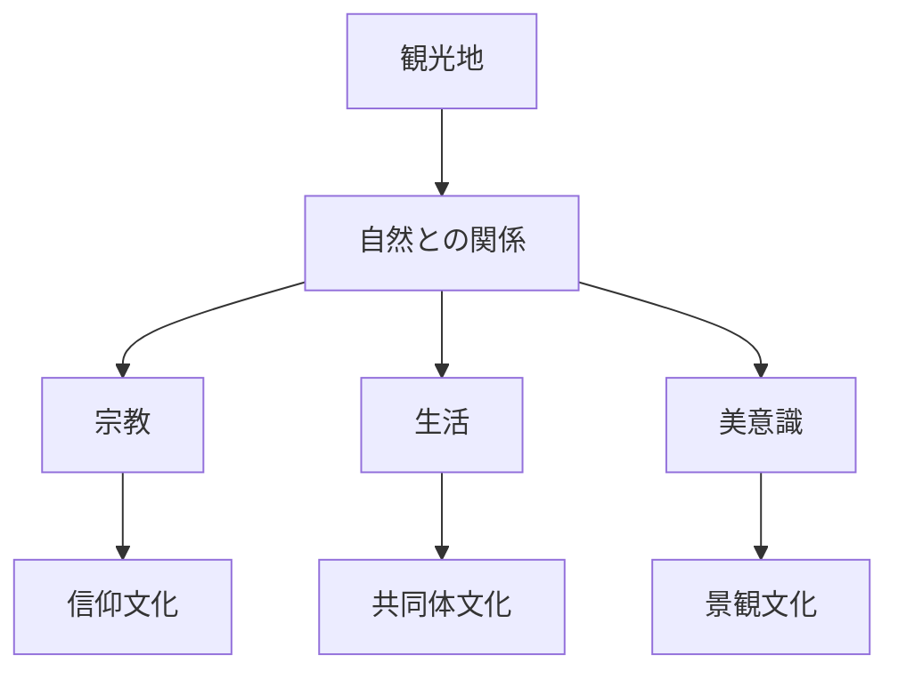

# 自然共生原理  
Nature Relation

自然共生原理とは、日本文化において自然が単なる外部環境や征服対象ではなく、  
**人間生活・宗教・美意識・共同体と連続した存在として理解される原理**である。

---

# 核心

日本文化では自然は

- 資源
- 景観
- 信仰
- 美

を同時に担う存在である。

自然は

- 神が宿る場
- 季節を感じる媒体
- 共同体生活の基盤
- 美意識の源泉

として理解される。

---

# 背景

## 地理条件

日本列島は

- 山地が多い
- 森林が多い
- 災害が多い
- 河川が短い

このため自然を完全に支配するより  
**自然に適応する生活様式**が発達した。

---

## 生業

稲作社会では

- 水管理
- 季節把握
- 共同作業

が必要となる。

自然は単なる景観ではなく  
**共同体の生存基盤**となった。

---

## 宗教

神道では

- 山
- 森
- 岩
- 滝
- 海

など自然そのものが神聖性を持つ。

自然は「神の創造物」ではなく  
**神が宿る場所**として理解される。

---

# 構造

---

# 文化への影響

## 宗教

自然信仰

例

- 富士山
- 熊野
- 三輪山
- 那智の滝

---

## 建築

自然と建築を分離しない。

例

- 縁側
- 障子
- 庭園
- 借景

---

## 文学

自然描写が人間の感情や人生観と結びつく。

例

- 和歌
- 俳句
- 随筆

---

## 行事

季節変化を文化として社会化する。

例

- 花見
- 月見
- 紅葉狩り
- 祭礼

---

# 観光説明での使い方

---

# 例

## 神社

WHAT  
神社

HOW  
自然地形の中に建立される

WHY  
自然そのものに神が宿ると考えられるため

---

## 庭園

WHAT  
日本庭園

HOW  
自然景観を縮小・象徴化する

WHY  
自然を秩序ある美として表現する文化があるため

---

# 他のKernelとの関係

- [[Impermanence]]
- [[Seasonal Sensibility]]
- [[Purity and Pollution]]
- [[Spatial Awareness]]

---

# 一言で言うと

日本文化では  
**自然は背景ではなく文化の中心にある。**