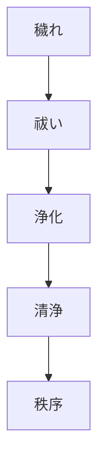
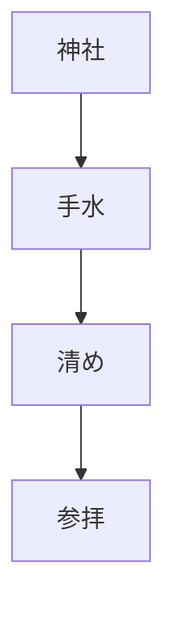

# 清浄原理  
Purity and Pollution

清浄原理とは、  
**清い状態と穢れた状態を区別し、清浄を維持することを重視する日本文化の原理**である。

日本文化では

- 身体
- 空間
- 行為

が清浄であることが重要視される。

---

# 核心

社会や宗教では

- 穢れを除く
- 清める

という行為が重要である。

---

# 背景

## 神道

神道では

- 穢れ
- 祓い

という概念が重要である。

穢れは

- 死
- 血
- 病

などと結びつく。

---

## 自然

水や自然は

**浄化**

の象徴として理解される。

---

## 社会秩序

清浄は

- 社会秩序
- 宗教儀礼

を維持する役割を持つ。

---

# 構造

---

# 文化への影響

## 神社参拝

参拝前に

- 手水
- 祓い

を行う。

---

## 生活文化

日本では

- 清掃
- 入浴

などが重要視される。

---

## 宗教儀礼

神道の儀礼では

- 祓い
- 清め

が中心となる。

---

# 観光説明での使い方

---

# 例

## 手水

WHAT  
手水

HOW  
手と口を水で清める

WHY  
神聖な場所に入る前に穢れを除くため

---

## 大祓

WHAT  
大祓

HOW  
祓いの儀式

WHY  
社会の穢れを清めるため

---

# 他のKernelとの関係

- [[Nature Relation]]
- [[Ritualization]]
- [[Harmony]]

---

# 一言で言うと

日本文化では

**清さが秩序を生む。**