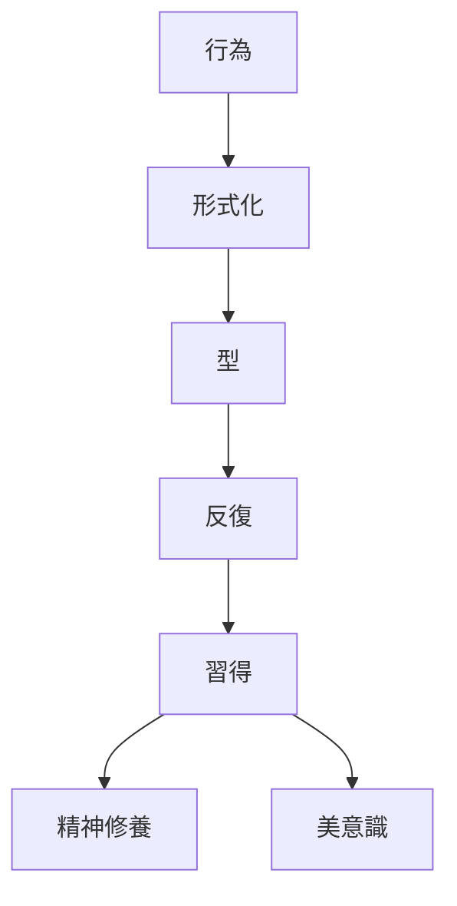
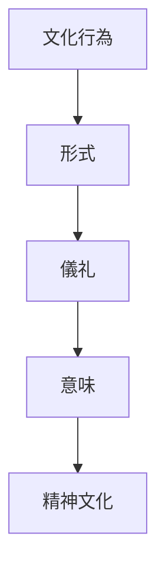

# 儀礼化原理  
Ritualization

儀礼化原理とは、  
**日常行為を形式化・象徴化することで意味を与える日本文化の原理**である。

日本文化では

- 宗教
- 社会行動
- 芸術
- 武道

など多くの分野で行為が

**定められた型（形式）**

として実践される。

---

# 核心

行為は単なる実用ではなく

- 型
- 手順
- 作法

を通じて意味を持つ。

この型は

- 精神修養
- 社会秩序
- 美意識

と結びつく。

---

# 背景

## 宗教

神道では

- 祓い
- 祝詞
- 神事

などの儀礼が重要である。

---

## 武士文化

武士社会では

- 礼
- 作法
- 武道の型

が精神修養と結びついた。

---

## 芸道

日本の芸術では

- 茶道
- 華道
- 書道

など、技術が

**道（修行）**

として体系化された。

---

# 構造

---

# 文化への影響

## 茶道

- 手順
- 道具
- 動作

すべてが型として決まっている。

---

## 武道

武道では

- 型
- 礼

が重要である。

---

## 神道儀礼

神社では

- 参拝作法
- 神事

が定められている。

---

# 観光説明での使い方

---

# 例

## 茶道

WHAT  
茶道

HOW  
決まった手順で茶を点てる

WHY  
行為を通じて精神修養と美を表現するため

---

## 神社参拝

WHAT  
参拝作法

HOW  

- 手水
- 二礼二拍手一礼

WHY  
神に対する敬意を儀礼として表すため

---

# 他のKernelとの関係

- [[Harmony]]
- [[Hierarchy]]
- [[Purity and Pollution]]

---

# 一言で言うと

日本文化では

**行為は形式によって意味を持つ。**