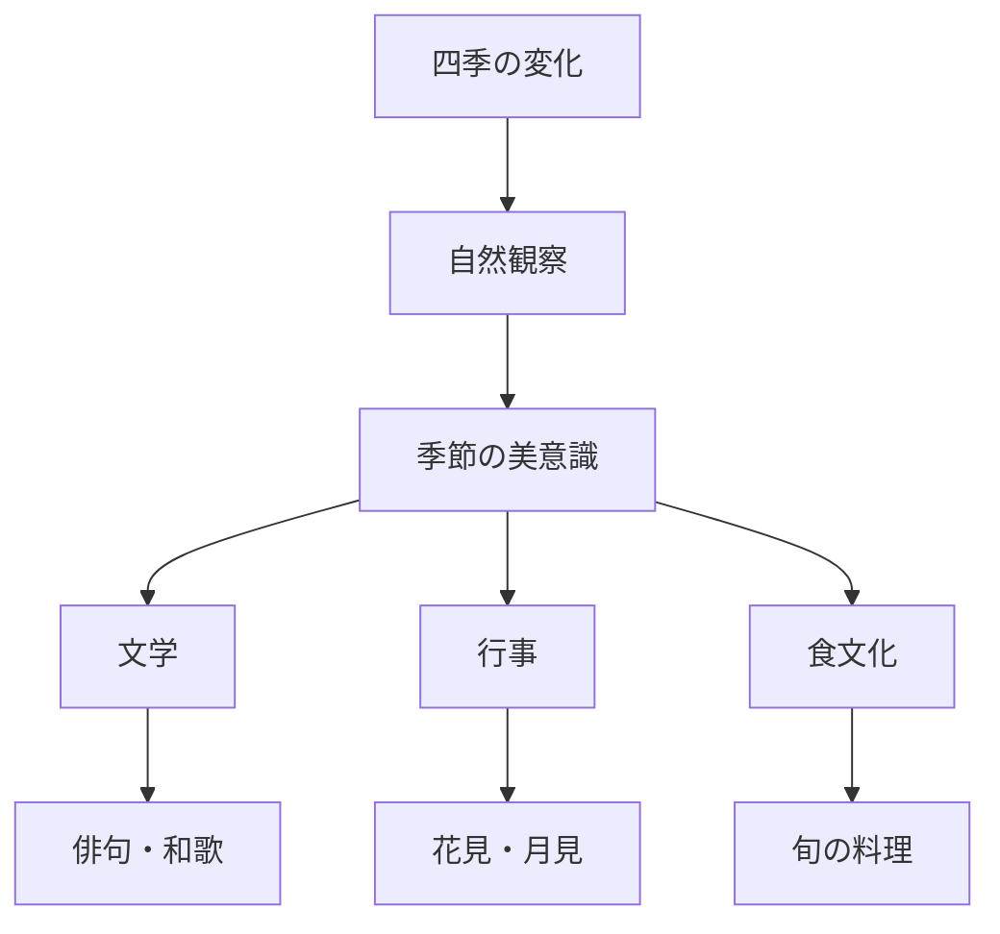
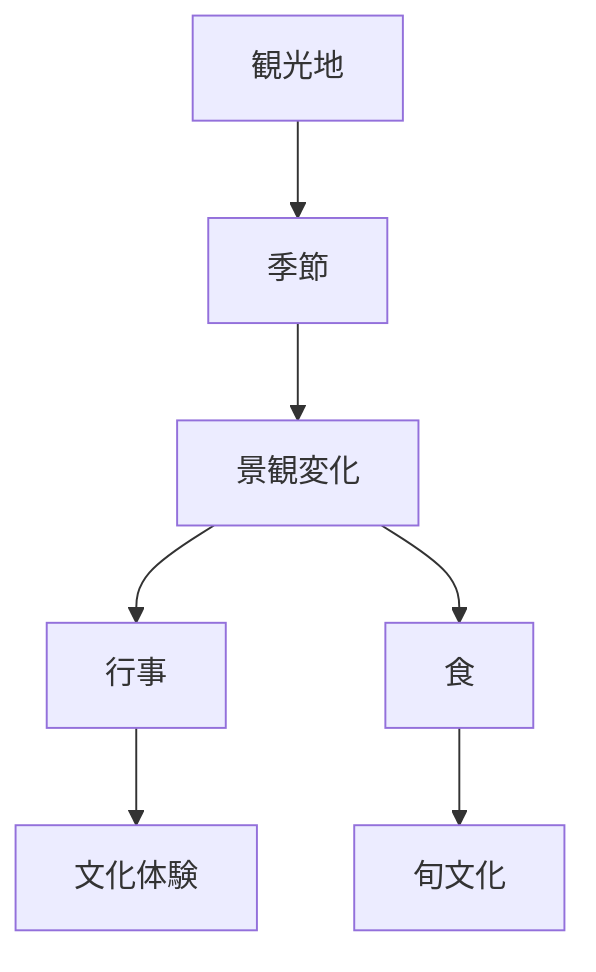

# 季節感原理  
Seasonal Sensibility

季節感原理とは、  
**四季の変化を文化・美意識・生活行動の中心として捉える日本文化の原理**である。

日本文化では自然の季節変化が

- 美
- 行事
- 食
- 文学
- 観光

などの多くの領域に組み込まれている。

---

# 核心

季節は単なる気候ではなく

- 美の対象
- 社会行動の契機
- 文化のリズム

として機能する。

---

# 背景

## 四季の明確さ

日本は

- 春
- 夏
- 秋
- 冬

の変化が比較的明確である。

これにより季節の移り変わりが生活と文化に強く影響した。

---

## 農業社会

稲作は

- 植える
- 育てる
- 収穫

という季節サイクルに依存する。

そのため季節感は  
**生活リズムそのもの**となった。

---

## 文学文化

和歌や俳句では

**季節語（季語）**

が重要な役割を持つ。

---

# 構造

---

# 文化への影響

## 行事

季節ごとに行動がある。

例

- 花見
- 月見
- 紅葉狩り
- 初詣

---

## 食文化

日本料理では

**旬**

が重要である。

例

- 春：山菜
- 夏：鰻
- 秋：松茸
- 冬：鍋

---

## 文学

俳句では季語が必須。

例

- 桜
- 蝉
- 紅葉
- 雪

---

## 観光

観光地は季節で魅力が変わる。

例

- 春：桜
- 夏：祭り
- 秋：紅葉
- 冬：雪景色

---

# 観光説明での使い方

---

# 例

## 桜

WHAT  
桜

HOW  
春に短期間開花する

WHY  
日本文化では季節変化を美として楽しむため

---

## 紅葉

WHAT  
紅葉

HOW  
秋に葉が色づく

WHY  
四季の変化を景観として鑑賞する文化があるため

---

# 他のKernelとの関係

- [[Nature Relation]]
- [[Impermanence]]
- [[Aestheticization of Life]]

---

# 一言で言うと

日本文化では

**時間の流れが季節として美になる。**