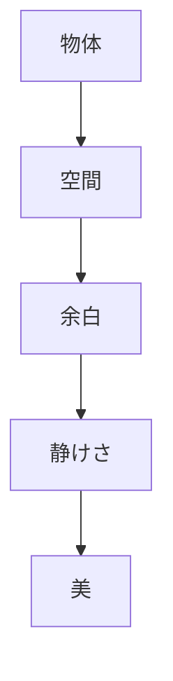
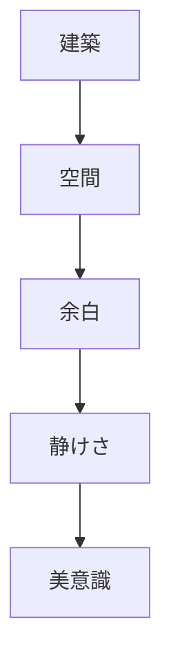

# 空間感覚原理  
Spatial Awareness / 間

空間感覚原理とは、  
**物体そのものだけでなく、その間に存在する空間や余白に意味と美を見出す日本文化の原理**である。

日本文化では

- 空間
- 距離
- 余白

が重要な意味を持つ。

---

# 核心

空間は

- 何もない場所
ではなく

**意味を持つ場所**

として理解される。

---

# 背景

## 建築文化

日本建築では

- 障子
- 襖
- 縁側

など可変的な空間が多い。

---

## 禅思想

禅では

- 空
- 静けさ

が重要な価値となる。

---

## 芸術

日本の芸術では

- 余白
- 間

が重要な構成要素となる。

---

# 構造

---

# 文化への影響

## 建築

日本建築では

- 空間の連続
- 内外の曖昧な境界

が特徴である。

---

## 庭園

庭園では

- 空間配置
- 視線

が重要となる。

---

## 芸術

絵画や書道では

- 余白

が重要な表現となる。

---

# 観光説明での使い方

---

# 例

## 茶室

WHAT  
茶室

HOW  
小さく余白の多い空間

WHY  
空間そのものに意味を持たせる文化があるため

---

## 枯山水庭園

WHAT  
石庭

HOW  
石と空間の配置

WHY  
余白によって自然を象徴するため

---

# 他のKernelとの関係

- [[Minimalism]]
- [[Nature Relation]]
- [[Ritualization]]

---

# 一言で言うと

日本文化では

**空間そのものが意味を持つ。**