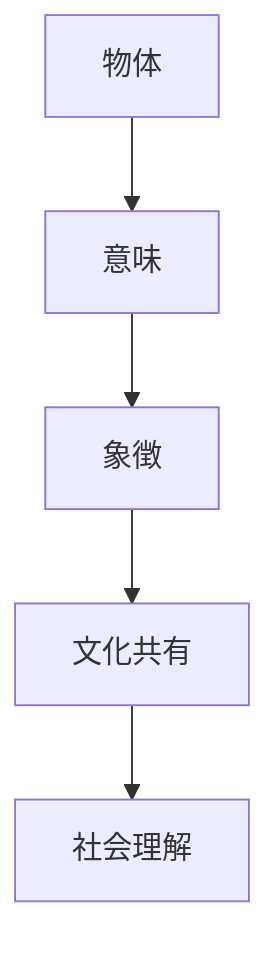
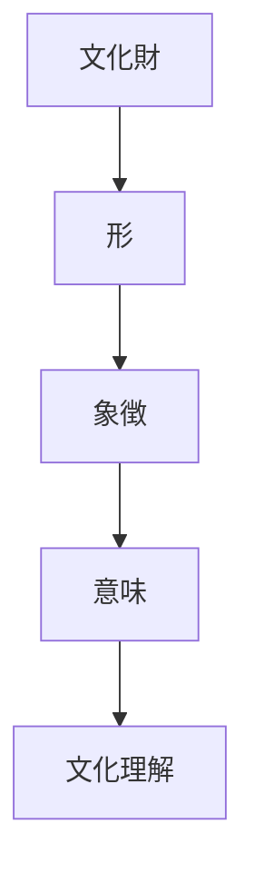

# 象徴原理  
Symbolism

象徴原理とは、  
**物や形がそのもの以上の意味を表す文化的記号として機能する日本文化の原理**である。

日本文化では

- 建築
- 宗教
- 芸術
- 家紋
- 文様

など多くの領域で形や物が象徴的意味を持つ。

---

# 核心

文化では

- 物そのもの
より

**物が表す意味**

が重要になる。

---

# 背景

## 宗教

神道では

- 鳥居
- 神体
- 御神木

などが神聖性を象徴する。

---

## 権威

日本社会では

- 家紋
- 衣装
- 建築

などが地位や権威を象徴する。

---

## 芸術

芸術では

- 文様
- モチーフ

が象徴的意味を持つ。

---

# 構造

---

# 文化への影響

## 神社

鳥居は

- 神域
- 聖域

を象徴する。

---

## 家紋

家紋は

- 家
- 血統

を象徴する。

---

## 文様

日本の文様には

- 鶴
- 亀
- 松

など縁起を象徴するものが多い。

---

# 観光説明での使い方

---

# 例

## 鳥居

WHAT  
鳥居

HOW  
神社の入口にある門

WHY  
神聖な領域の境界を象徴するため

---

## 富士山

WHAT  
富士山

HOW  
日本最高峰の山

WHY  
日本文化や信仰の象徴となっているため

---

# 他のKernelとの関係

- [[Spatial Awareness]]
- [[Ritualization]]
- [[Narrative Tradition]]

---

# 一言で言うと

日本文化では

**形は意味を表す。**