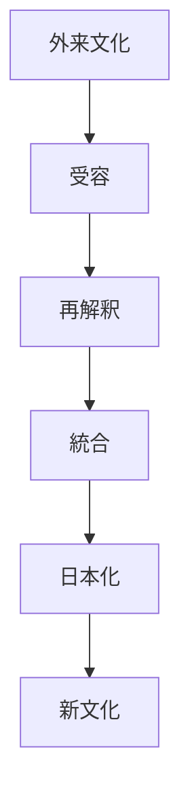
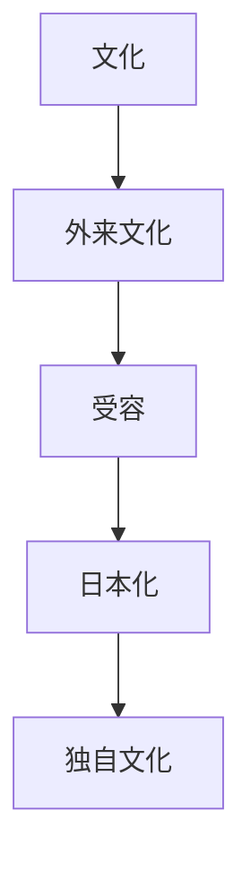

# 習合原理  
Syncretism

習合原理とは、  
**異なる宗教・文化・制度を排除せず統合して共存させる日本文化の原理**である。

日本文化では外来文化がそのまま受け入れられるのではなく、

- 日本化
- 混合
- 再解釈

されることで独自の文化体系が形成される。

---

# 核心

日本文化は

- 異なる文化を排除するのではなく
- 組み合わせ
- 調整し
- 新しい体系を作る

傾向を持つ。

---

# 背景

## 地理

日本は島国であり

- 外来文化は断続的に流入する
- 内部社会は比較的安定

という状況があった。

そのため文化は

**段階的に吸収・統合**

される傾向があった。

---

## 宗教

日本では

- 神道
- 仏教

が対立するのではなく

**神仏習合**

という形で統合された。

---

## 政治

外来制度も

- 中国制度
- 西洋制度

などが日本的に再編された。

---

# 構造

---

# 文化への影響

## 宗教

神仏習合

例

- 神社と寺院の共存
- 神宮寺
- 本地垂迹思想

---

## 建築

寺院建築や神社建築も

- 中国
- 日本

の様式が混合している。

---

## 生活文化

日常生活でも

- 神道儀礼
- 仏教葬儀

などが共存する。

---

# 観光説明での使い方

---

# 例

## 神仏習合

WHAT  
神社と仏教の共存

HOW  
神を仏の化身として理解した

WHY  
異なる宗教を対立させず統合する文化があるため

---

## 和洋折衷

WHAT  
和洋折衷建築

HOW  
日本建築と西洋建築を組み合わせる

WHY  
外来文化を日本化する文化があるため

---

# 他のKernelとの関係

- [[Adaptation]]
- [[Ritualization]]
- [[Authority and Legitimacy]]

---

# 一言で言うと

日本文化では

**異文化は排除されず、統合される。**