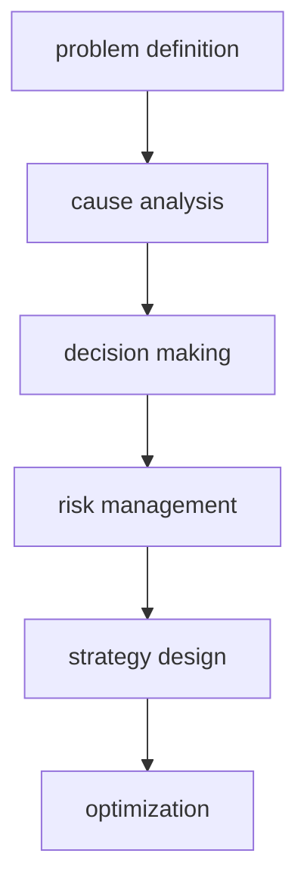

# 概要  
Problem Solving は、問題を分析し解決するための思考技法。World Model を、具体的な問題に適用する層。
# Solving Process
- [[01 problem definition]]（問題定義）
- [[02 cause analysis]]（原因分析）
- [[03 decision making]]（意思決定）
- [[04 risk management]]（リスク管理）
- [[05 strategy design]]（戦略設計）
- [[06 optimization]]（最適化）
# Type

- [[効率問題]]
- [[情報問題]]
- [[インセンティブ問題]]
- [[協調問題]]
- [[競争問題]]
- [[制約問題]]

# Relationship with Kernel
# How to Use