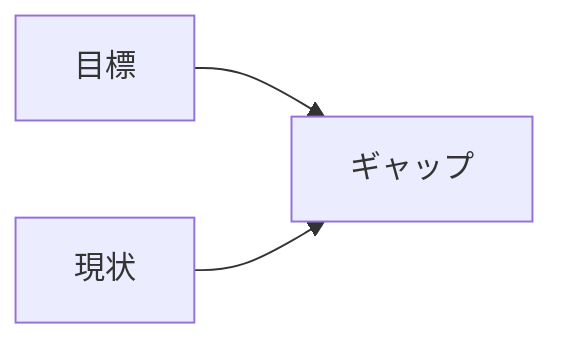

---
note_type:
  - parmanent
layer:
  - problem_sloving
status:
  - stable
maturity:
  - refined
domain:
related: []
problem_type:
  - efficiency
  - competiton
  - power
  - coordination
  - incentive
  - information
created: 2026-03-05
updated: 2026-03-05
---
問題定義とは、解決すべき問題を明確にするプロセスである。

# Translation
problem definition
# Engine
## 要素
- 目標
- 現状
- ギャップ
## 構造

問題とは、目標と現状の差分である。
# Understanding
問題定義は、
- [[因果]]    
- [[制約問題]]    
- [[効率問題]]
の理解に役立つ。
多くの問題は、問題の定義ミスから生まれる。
# Background
問題解決理論では、最も重要なステップは問題定義である。
# Example
# Use
- ビジネス分析   
- 政策分析    
- 問題解決
# 短縮版
1. 何が起きているか
2. 本当に解くべき問題は何か
3. 成功とは何か
4. 今回何を決めるのか

[[問題定義テンプレート]]
