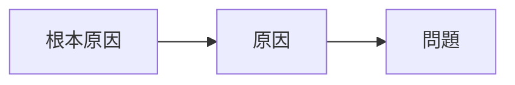

---
note_type:
  - parmanent
layer:
  - problem_sloving
status:
  - stable
maturity:
  - refined
domain:
related: []
problem_type:
  - efficiency
  - competiton
  - power
  - coordination
  - incentive
  - information
created: 2026-03-05
updated: 2026-03-05
---
原因分析とは、問題を引き起こす要因を特定するプロセスである。
# Translation
cause analysis
# Engine
## 要素
直接原因
- 間接原因
- 根本原因
## 構造

# Understanding
原因分析は、
- [[因果]]    
- [[情報問題]]    
- [[12 システム]]   
の理解に役立つ。
# Background
問題の多くは、複数原因によって発生する。
# Example
# Use
- 問題解決
- 政策分析
- 組織改善
