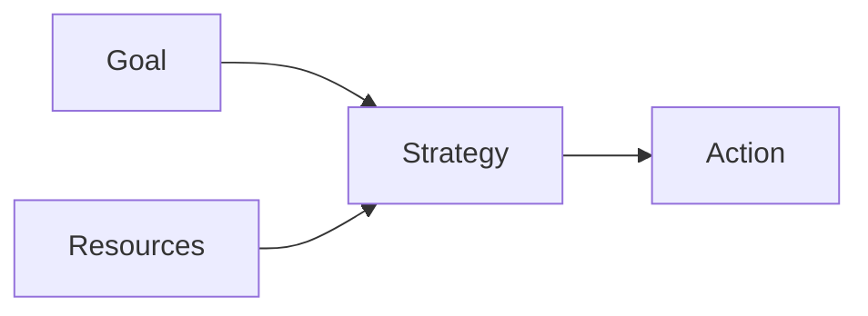

---
note_type:
  - parmanent
layer:
  - problem_sloving
status:
  - stable
maturity:
  - refined
domain:
related: []
problem_type:
  - efficiency
  - competiton
  - power
  - coordination
  - incentive
  - information
created: 2026-03-05
updated: 2026-03-05
---
戦略設計とは、目標を達成するための行動計画を設計するプロセスである。  
# Translation  
strategy design    
# Engine  
## 要素  
- 目標  
- [[01 資源]]
- 行動   
## 構造  

# Understanding
戦略設計は
- [[競争]]    
- [[10 効率]]    
- [[02_zettelkasten/Zettelkasten Engine/01_knowledge/world_model/concept/制約]]
に関係する。
# Background
戦略とは、限られた資源の配分である。
# Example
企業戦略
- コスト戦略
- 差別化戦略
# Use
- 経営
- 政策
- 軍事