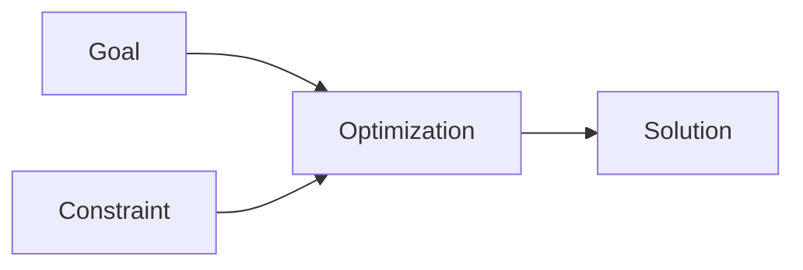

---
note_type:
  - parmanent
layer:
  - problem_sloving
status:
  - stable
maturity:
  - refined
domain:
related: []
problem_type:
  - efficiency
  - competiton
  - power
  - coordination
  - incentive
  - information
created: 2026-03-05
updated: 2026-03-05
---
最適化とは、制約条件の中で最も良い結果を得る方法を探すプロセスである。  
# Translation  
optimization  
# Engine  
## 要素  
- 目標  
- [[02_zettelkasten/Zettelkasten Engine/02_knowledge/world_model/concept/制約]]
- 解  
## 構造  
  

# Understanding
最適化は、
- [[02_zettelkasten/Zettelkasten Engine/02_knowledge/world_model/concept/制約]]    
- [[10 効率]]    
- [[11 トレードオフ]]   
に関係する。
# Background
多くの問題は、制約付き最適化として表現できる。
# Example
物流
- 配送効率    
- コスト最小   
# Use
- 経営
- 物流
- 政策