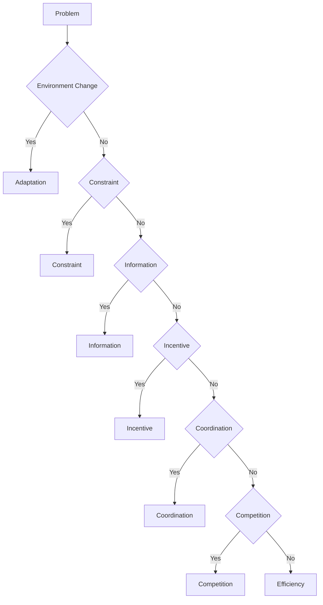

# Problem Types
問題は多くの場合、次の6種類に分類できる。この分類は、経済・組織・政治・ビジネス・社会などの問題分析の基本枠となる。
- [[効率問題]]（効率）
- [[競争問題]]（競争）
- [[権力問題]]（権力）
- [[協調問題]]（協調）
- [[インセンティブ問題]]（インセンティブ）
- [[情報問題]]（情報）
- [[適応問題]]（適応） 
- [[制約問題]]（制約）

# 各 Problem Type
## Efficiency Problem
資源が最適に配分されていない。
例
- 
- 生産性低い
- コスト高い
## Information Problem
必要な情報が不足している。
例
- 不完全情報
- 情報非対称
## Incentive Problem
行動動機が望ましい結果と一致していない。
例
- モラルハザード
- 代理人問題
## Coordination Problem
主体同士の行動が調整されていない。
例
- 交通
- 標準規格
## Competition Problem
競争構造が問題。
例
- 独占 
- 過当競争
## Constraint Problem
資源や制度の制約。
例
- 資金不足
- 法規制
## Adaptation Problem
環境変化に適応できない。
例
- 技術革新
- 市場変化
# Problem Diagnosis Flow
問題は次の順序で診断する。

# Correspondence Table
| Problem Type | 主原因  | 主分析        | 補助分析            |
| ------------ | ---- | ---------- | --------------- |
| Efficiency   | 無駄   | プロセス分析     | ボトルネック分析        |
| Information  | 情報不足 | 仮説検証       | 小実験             |
| Incentive    | 誘因ミス | インセンティブ分析  | Principal-Agent |
| Coordination | 協力失敗 | ステークホルダー分析 | 信頼構造分析          |
| Competition  | 競争   | 競争戦略分析     | ゲーム理論           |
| Constraint   | 資源不足 | 制約分析       | トレードオフ分析        |
| Adaptation   | 環境変化 | 実験・進化      | シナリオ分析          |
# Relationship with Kernel
# How to Use
新しい問題に遭遇したら、まず次を判断する。
- これはどの problem_type か？
多くの場合、1つまたは2つの組み合わせになる。
