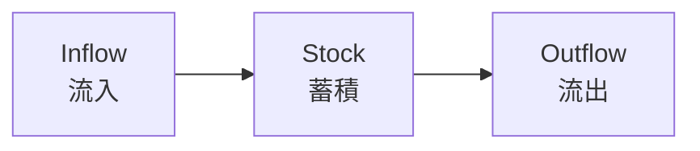

---
note_type:
  - parmanent
layer:
  - system_model
status:
  - stable
maturity:
  - canonical
domain: knowledge_architecture
related:
problem_type:
created: 2026-03-05
updated: 2026-03-06
---
ストック・フローモデルとは、システム内の蓄積量（ストック）と、その増減を生む流れ（フロー）の関係を表すモデルである。
# Translation
stock and flow

# Engine
## 要素
- ストック
- 流入
- 流出
## 構造

ストックは、流入と流出によって変化する。
# Understanding
ストック・フローモデルは
- [[12 システム]]
- [[10 効率]]    
- [[因果]]   
の理解に役立つ。
多くの社会現象は、ストックとフローによって説明できる。
# Background
ストック・フロー概念は
- 経済学
- システムダイナミクス
- 生態学
などで発展した。
システムの変化は、蓄積量の変化として理解できる。
# Example
人口

# Use
- 人口分析
- 経済分析
- 在庫管理
- 資源管理