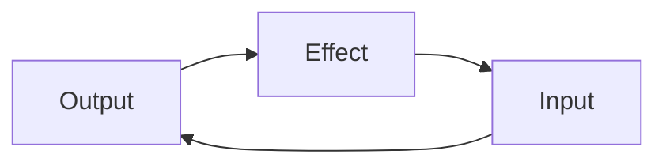
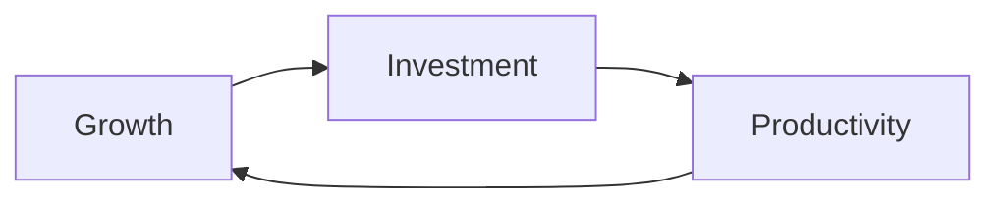
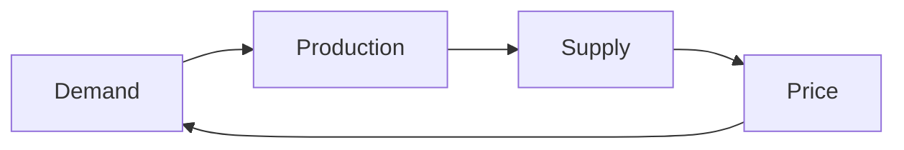

---
note_type:
  - parmanent
layer:
  - system_model
status:
  - stable
maturity:
  - canonical
domain: knowledge_architecture
related:
problem_type:
created: 2026-03-05
updated: 2026-03-06
---
フィードバックループとは、システムの出力が再び入力として作用し、システムの振る舞いを変化させる構造である。
# Translation
feedback loop
# Engine
## 要素
- 出力
- 影響
- 再入力
## 構造

フィードバックは、結果から原因が再び作用する構造である。
# 類型
## 強化ループ（Reinforcing Loop）

結果がさらに結果を強める。
## 均衡ループ（Balancing Loop）

システムを安定させる。
# Understanding
フィードバックは、
- [[12 システム]]    
- [[因果]]    
- [[10 効率]]    
- [[情報]]    
に影響する。
多くの社会現象は、フィードバック構造によって動く。
# Background
フィードバック概念は、
- 制御工学
- サイバネティクス
- システム理論
から発展した。
社会や経済でも、フィードバックが重要である。
# Example
## 強化ループ
- SNS拡散
- ネットワーク効果
- 技術革新
## 均衡ループ
- 価格調整    
- 市場均衡    
- 在庫調整
# Use
- 経済分析
- 社会分析
- 組織分析
- システム設計