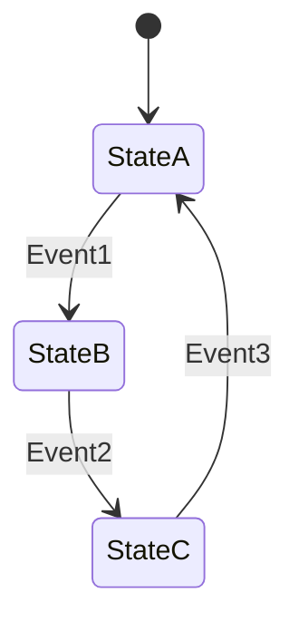
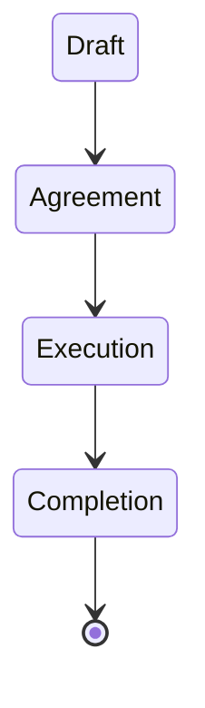

---
note_type:
  - parmanent
layer:
  - system_model
status:
  - stable
maturity:
  - canonical
domain: knowledge_architecture
related:
problem_type:
created: 2026-03-05
updated: 2026-03-06
---
状態遷移とは、システムがある状態から別の状態へ変化する過程を表すモデルである。
# Translation
state transition
# Engine
## 要素
- 状態
- 事象
- 遷移
## 構造

状態遷移は、状態→事象→次の状態という構造で進む。
# Understanding
状態遷移モデルは、
- [[12 システム]]    
- [[因果]]    
- [[02_zettelkasten/01_knowledge/world_model/concept/制約]]    
の理解に役立つ。
多くの社会活動は、状態遷移の連続として表現できる。
# Background
状態遷移モデルは、
- オートマトン理論    
- ソフトウェア設計    
- 業務プロセス設計
などで発展した。
システムの振る舞いを、離散的な状態として理解する。
# Example
契約

# Use
- 業務フロー    
- 契約ライフサイクル    
- 顧客管理    
- システム設計