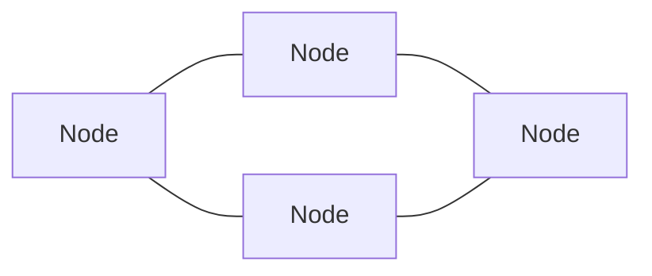
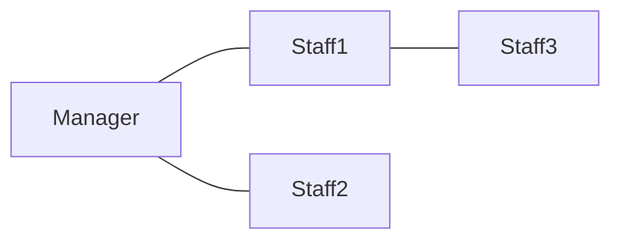

---
note_type:
  - parmanent
layer:
  - system_model
status:
  - stable
maturity:
  - canonical
domain: knowledge_architecture
related:
problem_type:
created: 2026-03-05
updated: 2026-03-06
---
紐帯モデルとは、主体（ノード）とその関係（エッジ）によって構成される構造を表すモデルである。
# Translation
network model
# Engine
## 要素
- ノード
- 関係
- 中心性
- 密度
## 構造

紐帯は、ノードと関係の組み合わせによって構成される。
# Understanding
ネットワークモデルは
- [[05 紐帯]]    
- [[情報]]    
- [[08 権力]]    
- [[12 システム]]    
の理解に役立つ。
ネットワークは、情報・資源・影響力の流れを決める。
# Background
ネットワーク概念は
- 社会学
- グラフ理論
- 情報科学
などから発展した。
社会構造の多くは、ネットワーク構造として理解できる。
# Example
組織

# Use
- 組織分析    
- 社会ネットワーク分析    
- 市場構造分析    
- 情報拡散